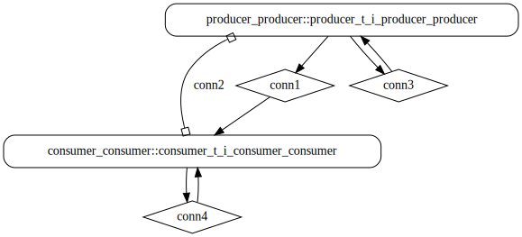

# test_event_port_periodic_domains

 Table of Contents
<!--table-of-contents_start-->
* [AADL Architecture](#aadl-architecture)
* [Linux](#linux)
  * [HAMR Configuration: Linux](#hamr-configuration-linux)
  * [Behavior Code: Linux](#behavior-code-linux)
  * [How to Build/Run: Linux](#how-to-buildrun-linux)
* [SeL4](#sel4)
  * [HAMR Configuration: SeL4](#hamr-configuration-sel4)
  * [Behavior Code: SeL4](#behavior-code-sel4)
  * [How to Build/Run: SeL4](#how-to-buildrun-sel4)
  * [Example Output: SeL4](#example-output-sel4)
  * [CAmkES Architecture: SeL4](#camkes-architecture-sel4)
  * [HAMR CAmkES Architecture: SeL4](#hamr-camkes-architecture-sel4)
<!--table-of-contents_end-->

This example illustrates how to model and implement event port communications between
components. In this context, an event port communication is a simple event signal
sent from a sending component to one or more receiving components. No data
is associated with the event signal, and events queued.
Both write and read operations are non-blocking.

This example also illustrates the use of periodic component scheduling. For a
seL4 target, the implementation employs a static cyclic scheduler. Each
component is assigned a domain (or temporal partition) and typically a domain
is assigned a single component (domain zero is reserved for seL4 infrastructure
and must be invoked regularly to maintain operational flow). The schedule consists
of a series of ordered (non-overlapping) time slots of a specific length and domain.
Time slot lengths are expressed as a number of ticks (by default a tick is
2 milliseconds). The user defines the component schedule in the *domain_schedule.c*
file. 

For seL4 targets, the static cyclic scheduler maintains temporal isolation
between the components, assuming the domain schedule has been correctly engineered.
It is the responsibility of the system designer to define a schedule
in which the components execute to completion within their assigned slots.
A component execution that exceeds the length of a time slot will resume from
where it left off when its next assigned time slot is invoked. 
For Linux targets, the components follow the default round-robin periodic
scheduler employed by the Linux operating system.

Further details regarding modeling guidelines and HAMR integration can be found
in the [CASE-Tool-Assessment-Guide](https://github.com/loonwerks/CASE/tree/master/TA5/tool-assessment-4/doc/CASE-Tool-Assessment-Guide.pdf).


## AADL Architecture
<!--aadl-architecture_start-->

|System: [top_impl_Instance](aadl/test_event_port_periodic_domains.aadl#L80) Properties|
|--|
|Domain Scheduling|

|[producer](aadl/test_event_port_periodic_domains.aadl#L12) Properties|
|--|
|Native|
|Periodic: 1000 ms|
|Domain: 2|


|[consumer](aadl/test_event_port_periodic_domains.aadl#L39) Properties|
|--|
|Native|
|Periodic: 1000 ms|
|Domain: 3|


**Schedule:** [domain_schedule.c](aadl/domain_schedule.c)
<!--aadl-architecture_end-->


## Linux
<!--Linux_start--><!--Linux_end-->

### HAMR Configuration: Linux
<!--hamr-configuration-linux_start-->
To run HAMR Codegen, select [this](aadl/test_event_port_periodic_domains.aadl#L80) system implementation in FMIDE's outline view and then click the
HAMR button in the toolbar.  Use the following values in the dialog box that opens up (_&lt;example-dir&gt;_ is the directory that contains this readme file)

Option Name|Value |
|--|--|
Platform|Linux|
Output Directory|_&lt;example-dir&gt;_/hamr/slang|
Base Package Name|base|
|Exclude Slang Component Implementations|True/Checked|
|Bit Width|32|
|Max Sequence Size|1|
|Max String Size|256|
|C Output Directory|_&lt;example-dir&gt;_/hamr/c|

You can have HAMR's FMIDE plugin generate verbose output and run the transpiler by setting the ``Verbose output`` and ``Run Transpiler``
options that are located in __Preferences >> OSATE >> Sireum HAMR >> Code Generation__.


<details>

<summary>Click for instructions on how to run HAMR Codegen via the command line</summary>

The script [aadl/bin/run-hamr-Linux.sh](aadl/bin/run-hamr-Linux.sh) uses an experimental OSATE/FMIDE plugin we've developed that
allows you to run HAMR's OSATE/FMIDE plugin via the command line.  It has primarily been used/tested
when installed in OSATE (not FMIDE) and under Linux so may not work as expected in FMIDE or
under a different operating system. The script contains instructions on how to install the plugin.

```
./aadl/bin/run-hamr-Linux.sh <path-to-FMIDE-executable>
```

</details>
<!--hamr-configuration-linux_end-->


### Behavior Code: Linux
<!--behavior-code-linux_start-->
  * [producer](hamr/c/ext-c/producer_t_i_producer_producer/producer_t_i_producer_producer.c)

  * [consumer](hamr/c/ext-c/consumer_t_i_consumer_consumer/consumer_t_i_consumer_consumer.c)
<!--behavior-code-linux_end-->


### How to Build/Run: Linux
<!--how-to-buildrun-linux_start-->
If you didn't configure HAMR's FMIDE plugin to run the transpiler automatically then first run
```
./hamr/slang/bin/transpile.cmd
```
then 
```
./hamr/c/bin/compile.cmd
./hamr/c/bin/run.sh
./hamr/c/bin/stop.sh
```
<!--how-to-buildrun-linux_end-->


## SeL4
<!--SeL4_start--><!--SeL4_end-->

### HAMR Configuration: SeL4
<!--hamr-configuration-sel4_start-->
To run HAMR Codegen, select [this](aadl/test_event_port_periodic_domains.aadl#L80) system implementation in FMIDE's outline view and then click the
HAMR button in the toolbar.  Use the following values in the dialog box that opens up (_&lt;example-dir&gt;_ is the directory that contains this readme file)

Option Name|Value |
|--|--|
Platform|SeL4|
Output Directory|_&lt;example-dir&gt;_/hamr/slang|
Base Package Name|base|
|Exclude Slang Component Implementations|True/Checked|
|Bit Width|32|
|Max Sequence Size|1|
|Max String Size|256|
|C Output Directory|_&lt;example-dir&gt;_/hamr/c|
|seL4/CAmkES Output Directory|_&lt;example-dir&gt;_/hamr/camkes

You can have HAMR's FMIDE plugin generate verbose output and run the transpiler by setting the ``Verbose output`` and ``Run Transpiler``
options that are located in __Preferences >> OSATE >> Sireum HAMR >> Code Generation__.


<details>

<summary>Click for instructions on how to run HAMR Codegen via the command line</summary>

The script [aadl/bin/run-hamr-SeL4.sh](aadl/bin/run-hamr-SeL4.sh) uses an experimental OSATE/FMIDE plugin we've developed that
allows you to run HAMR's OSATE/FMIDE plugin via the command line.  It has primarily been used/tested
when installed in OSATE (not FMIDE) and under Linux so may not work as expected in FMIDE or
under a different operating system. The script contains instructions on how to install the plugin.

```
./aadl/bin/run-hamr-SeL4.sh <path-to-FMIDE-executable>
```

</details>
<!--hamr-configuration-sel4_end-->


### Behavior Code: SeL4
<!--behavior-code-sel4_start-->
  * [producer](hamr/c/ext-c/producer_t_i_producer_producer/producer_t_i_producer_producer.c)

  * [consumer](hamr/c/ext-c/consumer_t_i_consumer_consumer/consumer_t_i_consumer_consumer.c)
<!--behavior-code-sel4_end-->


### How to Build/Run: SeL4
<!--how-to-buildrun-sel4_start-->
If you didn't configure HAMR's FMIDE plugin to run the transpiler automatically then run
```
./hamr/slang/bin/transpile-sel4.cmd
```
then

```
./hamr/camkes/bin/run-camkes.sh -s
```
<!--how-to-buildrun-sel4_end-->


### Example Output: SeL4
<!--example-output-sel4_start-->
Timeout = 18 seconds
```
Booting all finished, dropped to user space
Entering pre-init of consumer_t_i_consumer_consumer
Leaving pre-init of conEntering pre-init of producer_t_i_producer_producer
Leaving pre-init of producer_t_i_producer_sumer_t_i_consumer_consumer
producer
top_impl_Instance_consumer_consumer: Received 1 events on consume
top_impl_Instance_consumer_consumer: Received 2 events on consume
top_impl_Instance_consumer_consumer: Received 3 events on consume
top_impl_Instance_consumer_consumer: Received 4 events on consume
top_impl_Instance_consumer_consumer: Received 5 events on consume
top_impl_Instance_consumer_consumer: Received 6 events on consume

```
<!--example-output-sel4_end-->


### CAmkES Architecture: SeL4
<!--camkes-architecture-sel4_start-->

<!--camkes-architecture-sel4_end-->


### HAMR CAmkES Architecture: SeL4
<!--hamr-camkes-architecture-sel4_start-->

<!--hamr-camkes-architecture-sel4_end-->

