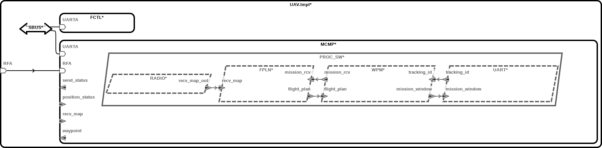
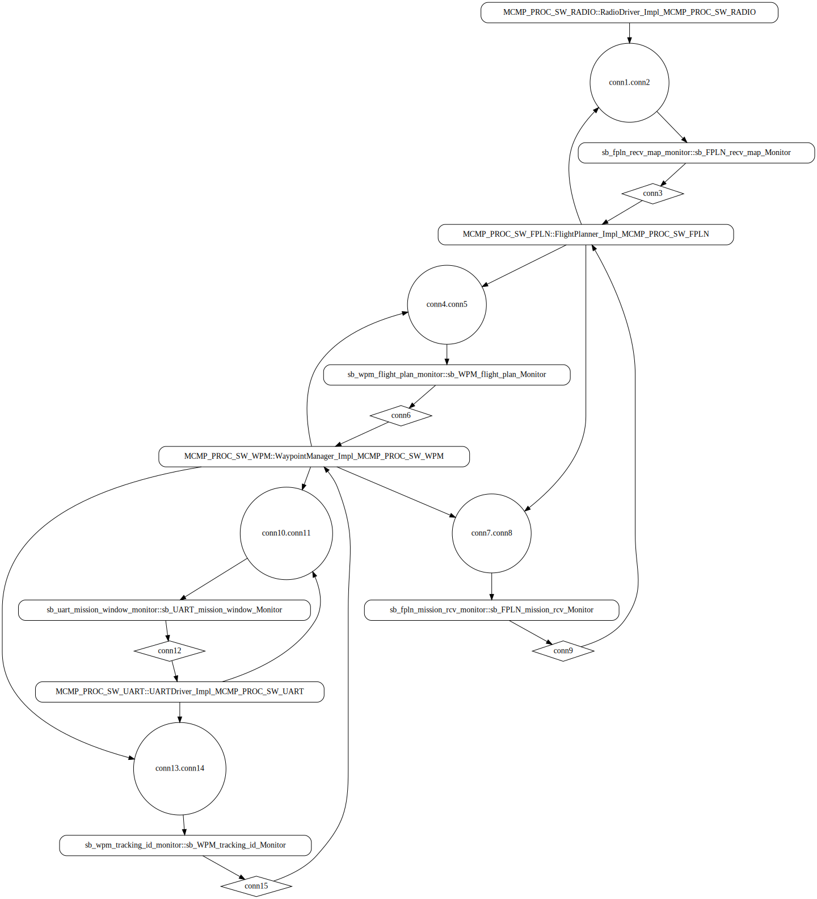
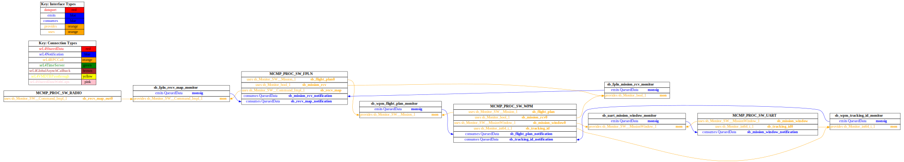
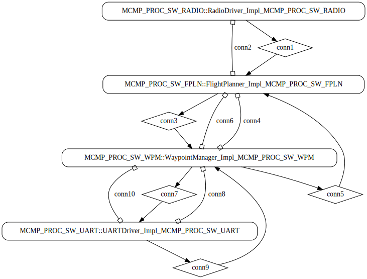
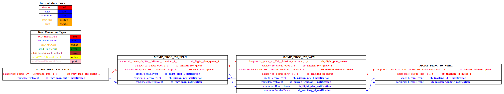

# simple_uav

 Table of Contents
<!--table-of-contents_start-->
  * [AADL Architecture](#aadl-architecture)
  * [SeL4_TB](#sel4_tb)
    * [HAMR Configuration: SeL4_TB](#hamr-configuration-sel4_tb)
    * [Behavior Code: SeL4_TB](#behavior-code-sel4_tb)
    * [How to Build/Run: SeL4_TB](#how-to-buildrun-sel4_tb)
    * [Example Output: SeL4_TB](#example-output-sel4_tb)
    * [CAmkES Architecture: SeL4_TB](#camkes-architecture-sel4_tb)
    * [HAMR CAmkES Architecture: SeL4_TB](#hamr-camkes-architecture-sel4_tb)
  * [SeL4_Only](#sel4_only)
    * [HAMR Configuration: SeL4_Only](#hamr-configuration-sel4_only)
    * [Behavior Code: SeL4_Only](#behavior-code-sel4_only)
    * [How to Build/Run: SeL4_Only](#how-to-buildrun-sel4_only)
    * [Example Output: SeL4_Only](#example-output-sel4_only)
    * [CAmkES Architecture: SeL4_Only](#camkes-architecture-sel4_only)
    * [HAMR CAmkES Architecture: SeL4_Only](#hamr-camkes-architecture-sel4_only)
<!--table-of-contents_end-->


## AADL Architecture
<!--aadl-architecture_start-->

|System: [UAV_Impl_Instance](aadl/UAV.aadl#L19) Properties|
|--|
|Domain Scheduling|

|[RADIO](aadl/SW.aadl#L74) Properties|
|--|
|Native|
|Sporadic|


|[FPLN](aadl/SW.aadl#L86) Properties|
|--|
|Native|
|Sporadic|


|[WPM](aadl/SW.aadl#L105) Properties|
|--|
|Native|
|Sporadic|


|[UART](aadl/SW.aadl#L124) Properties|
|--|
|Native|
|Sporadic|

<!--aadl-architecture_end-->


## SeL4_TB
<!--SeL4_TB_start--><!--SeL4_TB_end-->

### HAMR Configuration: SeL4_TB
<!--hamr-configuration-sel4_tb_start-->
To run HAMR Codegen, select [this](aadl/UAV.aadl#L19) system implementation in FMIDE's outline view and then click the
HAMR button in the toolbar.  Use the following values in the dialog box that opens up (_&lt;example-dir&gt;_ is the directory that contains this readme file)

Option Name|Value |
|--|--|
Platform|SeL4_TB|
|seL4/CAmkES Output Directory|_&lt;example-dir&gt;_/hamr_seL4_TB/camkes

You can have HAMR's FMIDE plugin generate verbose output and run the transpiler by setting the ``Verbose output`` and ``Run Transpiler``
options that are located in __Preferences >> OSATE >> Sireum HAMR >> Code Generation__.


<details>

<summary>Click for instructions on how to run HAMR Codegen via the command line</summary>

The script [aadl/bin/run-hamr-SeL4_TB.sh](aadl/bin/run-hamr-SeL4_TB.sh) uses an experimental OSATE/FMIDE plugin we've developed that
allows you to run HAMR's OSATE/FMIDE plugin via the command line.  It has primarily been used/tested
when installed in OSATE (not FMIDE) and under Linux so may not work as expected in FMIDE or
under a different operating system. The script contains instructions on how to install the plugin.

```
./aadl/bin/run-hamr-SeL4_TB.sh <path-to-FMIDE-executable>
```

</details>
<!--hamr-configuration-sel4_tb_end-->


### Behavior Code: SeL4_TB
<!--behavior-code-sel4_tb_start-->
  * [RADIO](aadl/behavior/radiodriver.c)

  * [FPLN](aadl/behavior/flightplanner.c)

  * [WPM](aadl/behavior/waypointmanager.c)

  * [UART](aadl/behavior/uartdriver.c)
<!--behavior-code-sel4_tb_end-->


### How to Build/Run: SeL4_TB
<!--how-to-buildrun-sel4_tb_start-->
```
./hamr_seL4_TB/camkes/bin/run-camkes.sh -s
```
<!--how-to-buildrun-sel4_tb_end-->


### Example Output: SeL4_TB
<!--example-output-sel4_tb_start-->
Timeout = 18 seconds
```
Booting all finished, dropped to user space
RDIO: initialise entry point called
RDIO:> Sending command.
FPLN:< Command.
  Map     = [
             0: {0, 1, 2}
             1: {1, 2, 3}
             2: {2, 3, 4}
             3: {3, 4, 5}
            ]
  Pattern = 2
  HMAC    = 1
FPLN:> new mission notification.
WM:< Received flight plan
  Mission:
    0: {0, 1, 2}
    1: {1, 2, 3}
    2: {2, 3, 4}
    3: {3, 4, 5}
    4: {4, 5, 6}
    5: {5, 6, 7}
    6: {6, 7, 8}
    7: {7, 8, 9}
    8: {8, 9, 10}
    9: {9, 10, 11}
WM:> Sent mission window
UART:< Received mission window
FPLN:< Received mission receipt confirmation: 1.
  MissionWindow:
    0: {0, 1, 2}
    1: {1, 2, 3}
    2: {2, 3, 4}
    3: {3, 4, 5}
UART:> Sending 1 as the next id.
WM:< Received 1 as the next id.
WM:> Sent mission window
UART:< Received mission window
  MissionWindow:
    0: {1, 2, 3}
    1: {2, 3, 4}
    2: {3, 4, 5}
    3: {4, 5, 6}
UART:> Sending 2 as the next id.
WM:< Received 2 as the next id.
WM:> Sent mission window
UART:< Received mission window
  MissionWindow:
    0: {2, 3, 4}
    1: {3, 4, 5}
    2: {4, 5, 6}
    3: {5, 6, 7}
UART:> Sending 3 as the next id.
WM:< Received 3 as the next id.
WM:> Sent mission window
UART:< Received mission window
  MissionWindow:
    0: {3, 4, 5}
    1: {4, 5, 6}
    2: {5, 6, 7}
    3: {6, 7, 8}
UART:> Sending 4 as the next id.
WM:< Received 4 as the next id.
WM:> Sent mission window
UART:< Received mission window
  MissionWindow:
    0: {4, 5, 6}
    1: {5, 6, 7}
    2: {6, 7, 8}
    3: {7, 8, 9}
UART:> Sending 5 as the next id.
WM:< Received 5 as the next id.
WM:> Sent mission window
UART:< Received mission window
  MissionWindow:
    0: {5, 6, 7}
    1: {6, 7, 8}
    2: {7, 8, 9}
    3: {8, 9, 10}
UART:> Sending 6 as the next id.
WM:< Received 6 as the next id.
WM:> Sent mission window
UART:< Received mission window
  MissionWindow:
    0: {6, 7, 8}
    1: {7, 8, 9}
    2: {8, 9, 10}
    3: {9, 10, 11}
UART:> Sending 7 as the next id.
WM:< Received 7 as the next id.
WM:> Sent mission window
UART:< Received mission window
  MissionWindow:
    0: {7, 8, 9}
    1: {8, 9, 10}
    2: {9, 10, 11}
    3: {0, 1, 2}
UART:> Sending 8 as the next id.
WM:< Received 8 as the next id.
WM:> Sent mission window
UART:< Received mission window
  MissionWindow:
    0: {8, 9, 10}
    1: {9, 10, 11}
    2: {0, 1, 2}
    3: {1, 2, 3}
UART:> Sending 9 as the next id.
WM:< Received 9 as the next id.
WM:> Sent mission window
UART:< Received mission window
  MissionWindow:
    0: {9, 10, 11}
    1: {0, 1, 2}
    2: {1, 2, 3}
    3: {2, 3, 4}
UART:> Sending 10 as the next id.
WM:< Received 10 as the next id.
WM:> Sent mission window
UART:< Received mission window
  MissionWindow:
    0: {0, 1, 2}
    1: {1, 2, 3}
    2: {2, 3, 4}
    3: {3, 4, 5}
UART:> Sending 11 as the next id.
WM:< Received 11 as the next id.
WM:> Sent mission window
UART:< Received mission window
  MissionWindow:
    0: {1, 2, 3}
    1: {2, 3, 4}
    2: {3, 4, 5}
    3: {4, 5, 6}
UART:> Sending 12 as the next id.
WM:< Received 12 as the next id.
WM:> Sent mission window
UART:< Received mission window
  MissionWindow:
    0: {2, 3, 4}
    1: {3, 4, 5}
    2: {4, 5, 6}
    3: {5, 6, 7}
UART:> Sending 13 as the next id.
WM:< Received 13 as the next id.
WM:> Sent mission window
UART:< Received mission window
  MissionWindow:
    0: {3, 4, 5}
    1: {4, 5, 6}
    2: {5, 6, 7}
    3: {6, 7, 8}
UART:> Sending 14 as the next id.
WM:< Received 14 as the next id.
WM:> Sent mission window
UART:< Received mission window
  MissionWindow:
    0: {4, 5, 6}
    1: {5, 6, 7}
    2: {6, 7, 8}
    3: {7, 8, 9}
UART:> Sending 15 as the next id.
WM:< Received 15 as the next id.
WM:> Sent mission window
UART:< Received mission window
  MissionWindow:
    0: {5, 6, 7}
    1: {6, 7, 8}
    2: {7, 8, 9}
    3: {8, 9, 10}
UART:> Sending 16 as the next id.
WM:< Received 16 as the next id.
WM:> Sent mission window
UART:< Received mission window
  MissionWindow:
    0: {6, 7, 8}
    1: {7, 8, 9}
    2: {8, 9, 10}
    3: {9, 10, 11}
UART:> Sending 17 as the next id.
WM:< Received 17 as the next id.
WM:> Sent mission window
UART:< Received mission window
  MissionWindow:
    0: {7, 8, 9}
    1: {8, 9, 10}
    2: {9, 10, 11}
    3: {0, 1, 2}
UART:> Sending 18 as the next id.
WM:< Received 18 as the next id.
WM:> Sent mission window
UART:< Received mission window
  MissionWindow:
    0: {8, 9, 10}
    1: {9, 10, 11}
    2: {0, 1, 2}
    3: {1, 2, 3}
UART:> Sending 19 as the next id.
WM:< Received 19 as the next id.
WM:> Sent mission window
UART:< Received mission window
  MissionWindow:
    0: {9, 10, 11}
    1: {0, 1, 2}
    2: {1, 2, 3}
    3: {2, 3, 4}
UART:> Sending 20 as the next id.
WM:< Received 20 as the next id.
WM:> Sent mission window
UART:< Received mission window
  MissionWindow:
    0: {0, 1, 2}
    1: {1, 2, 3}
    2: {2, 3, 4}
    3: {3, 4, 5}
UART:> Sending 21 as the next id.
WM:< Received 21 as the next id.
WM:> Sent mission window
UART:< Received mission window
  MissionWindow:
    0: {1, 2, 3}
    1: {2, 3, 4}
    2: {3, 4, 5}
    3: {4, 5, 6}
UART:> Sending 22 as the next id.
WM:< Received 22 as the next id.
WM:> Sent mission window
UART:< Received mission window
  MissionWindow:
    0: {2, 3, 4}
    1: {3, 4, 5}
    2: {4, 5, 6}
    3: {5, 6, 7}
UART:> Sending 23 as the next id.
WM:< Received 23 as the next id.
WM:> Sent mission window
UART:< Received mission window
  MissionWindow:
    0: {3, 4, 5}
    1: {4, 5, 6}
    2: {5, 6, 7}
    3: {6, 7, 8}
UART:> Sending 24 as the next id.
WM:< Received 24 as the next id.
WM:> Sent mission window
UART:< Received mission window
  MissionWindow:
    0: {4, 5, 6}
    1: {5, 6, 7}
    2: {6, 7, 8}
    3: {7, 8, 9}
UART:> Sending 25 as the next id.
WM:< Received 25 as the next id.
WM:> Sent mission window
UART:< Received mission window
  MissionWindow:
    0: {5, 6, 7}
    1: {6, 7, 8}
    2: {7, 8, 9}
    3: {8, 9, 10}

```
<!--example-output-sel4_tb_end-->


### CAmkES Architecture: SeL4_TB
<!--camkes-architecture-sel4_tb_start-->

<!--camkes-architecture-sel4_tb_end-->


### HAMR CAmkES Architecture: SeL4_TB
<!--hamr-camkes-architecture-sel4_tb_start-->

<!--hamr-camkes-architecture-sel4_tb_end-->


## SeL4_Only
<!--SeL4_Only_start--><!--SeL4_Only_end-->

### HAMR Configuration: SeL4_Only
<!--hamr-configuration-sel4_only_start-->
To run HAMR Codegen, select [this](aadl/UAV.aadl#L19) system implementation in FMIDE's outline view and then click the
HAMR button in the toolbar.  Use the following values in the dialog box that opens up (_&lt;example-dir&gt;_ is the directory that contains this readme file)

Option Name|Value |
|--|--|
Platform|SeL4_Only|
|seL4/CAmkES Output Directory|_&lt;example-dir&gt;_/hamr_seL4_Only/camkes

You can have HAMR's FMIDE plugin generate verbose output and run the transpiler by setting the ``Verbose output`` and ``Run Transpiler``
options that are located in __Preferences >> OSATE >> Sireum HAMR >> Code Generation__.


<details>

<summary>Click for instructions on how to run HAMR Codegen via the command line</summary>

The script [aadl/bin/run-hamr-SeL4_Only.sh](aadl/bin/run-hamr-SeL4_Only.sh) uses an experimental OSATE/FMIDE plugin we've developed that
allows you to run HAMR's OSATE/FMIDE plugin via the command line.  It has primarily been used/tested
when installed in OSATE (not FMIDE) and under Linux so may not work as expected in FMIDE or
under a different operating system. The script contains instructions on how to install the plugin.

```
./aadl/bin/run-hamr-SeL4_Only.sh <path-to-FMIDE-executable>
```

</details>
<!--hamr-configuration-sel4_only_end-->


### Behavior Code: SeL4_Only
<!--behavior-code-sel4_only_start-->
  * [RADIO](aadl/behavior/radiodriver.c)

  * [FPLN](aadl/behavior/flightplanner.c)

  * [WPM](aadl/behavior/waypointmanager.c)

  * [UART](aadl/behavior/uartdriver.c)
<!--behavior-code-sel4_only_end-->


### How to Build/Run: SeL4_Only
<!--how-to-buildrun-sel4_only_start-->
```
./hamr_seL4_Only/camkes/bin/run-camkes.sh -s
```
<!--how-to-buildrun-sel4_only_end-->


### Example Output: SeL4_Only
<!--example-output-sel4_only_start-->
Timeout = 18 seconds
```
Booting all finished, dropped to user space
RDIO: initialise entry point called
RDIO:> Sending command.
FPLN:< Command.
  Map     = [
             0: {0, 1, 2}
             1: {1, 2, 3}
             2: {2, 3, 4}
             3: {3, 4, 5}
            ]
  Pattern = 2
  HMAC    = 1
FPLN:> new mission notification.
WM:< Received flight plan
  Mission:
    0: {0, 1, 2}
    1: {1, 2, 3}
    2: {2, 3, 4}
    3: {3, 4, 5}
    4: {4, 5, 6}
    5: {5, 6, 7}
    6: {6, 7, 8}
    7: {7, 8, 9}
    8: {8, 9, 10}
    9: {9, 10, 11}
WM:> Sent mission window
UART:< Received mission window
  MissionWindow:
    0: {0, 1, 2}
    1: {1, 2, 3}
    2: {2, 3, 4}
    3: {3, 4, 5}
FPLN:< Received mission receipt confirmation: 1.
UART:> Sending 1 as the next id.
WM:< Received 1 as the next id.
WM:> Sent mission window
UART:< Received mission window
  MissionWindow:
    0: {1, 2, 3}
    1: {2, 3, 4}
    2: {3, 4, 5}
    3: {4, 5, 6}
UART:> Sending 2 as the next id.
WM:< Received 2 as the next id.
WM:> Sent mission window
UART:< Received mission window
  MissionWindow:
    0: {2, 3, 4}
    1: {3, 4, 5}
    2: {4, 5, 6}
    3: {5, 6, 7}
UART:> Sending 3 as the next id.
WM:< Received 3 as the next id.
WM:> Sent mission window
UART:< Received mission window
  MissionWindow:
    0: {3, 4, 5}
    1: {4, 5, 6}
    2: {5, 6, 7}
    3: {6, 7, 8}
UART:> Sending 4 as the next id.
WM:< Received 4 as the next id.
WM:> Sent mission window
UART:< Received mission window
  MissionWindow:
    0: {4, 5, 6}
    1: {5, 6, 7}
    2: {6, 7, 8}
    3: {7, 8, 9}
UART:> Sending 5 as the next id.
WM:< Received 5 as the next id.
WM:> Sent mission window
UART:< Received mission window
  MissionWindow:
    0: {5, 6, 7}
    1: {6, 7, 8}
    2: {7, 8, 9}
    3: {8, 9, 10}
UART:> Sending 6 as the next id.
WM:< Received 6 as the next id.
WM:> Sent mission window
UART:< Received mission window
  MissionWindow:
    0: {6, 7, 8}
    1: {7, 8, 9}
    2: {8, 9, 10}
    3: {9, 10, 11}
UART:> Sending 7 as the next id.
WM:< Received 7 as the next id.
WM:> Sent mission window
UART:< Received mission window
  MissionWindow:
    0: {7, 8, 9}
    1: {8, 9, 10}
    2: {9, 10, 11}
    3: {0, 1, 2}
UART:> Sending 8 as the next id.
WM:< Received 8 as the next id.
WM:> Sent mission window
UART:< Received mission window
  MissionWindow:
    0: {8, 9, 10}
    1: {9, 10, 11}
    2: {0, 1, 2}
    3: {1, 2, 3}
UART:> Sending 9 as the next id.
WM:< Received 9 as the next id.
WM:> Sent mission window
UART:< Received mission window
  MissionWindow:
    0: {9, 10, 11}
    1: {0, 1, 2}
    2: {1, 2, 3}
    3: {2, 3, 4}
UART:> Sending 10 as the next id.
WM:< Received 10 as the next id.
WM:> Sent mission window
UART:< Received mission window
  MissionWindow:
    0: {0, 1, 2}
    1: {1, 2, 3}
    2: {2, 3, 4}
    3: {3, 4, 5}
UART:> Sending 11 as the next id.
WM:< Received 11 as the next id.
WM:> Sent mission window
UART:< Received mission window
  MissionWindow:
    0: {1, 2, 3}
    1: {2, 3, 4}
    2: {3, 4, 5}
    3: {4, 5, 6}
UART:> Sending 12 as the next id.
WM:< Received 12 as the next id.
WM:> Sent mission window
UART:< Received mission window
  MissionWindow:
    0: {2, 3, 4}
    1: {3, 4, 5}
    2: {4, 5, 6}
    3: {5, 6, 7}
UART:> Sending 13 as the next id.
WM:< Received 13 as the next id.
WM:> Sent mission window
UART:< Received mission window
  MissionWindow:
    0: {3, 4, 5}
    1: {4, 5, 6}
    2: {5, 6, 7}
    3: {6, 7, 8}
UART:> Sending 14 as the next id.
WM:< Received 14 as the next id.
WM:> Sent mission window
UART:< Received mission window
  MissionWindow:
    0: {4, 5, 6}
    1: {5, 6, 7}
    2: {6, 7, 8}
    3: {7, 8, 9}
UART:> Sending 15 as the next id.
WM:< Received 15 as the next id.
WM:> Sent mission window
UART:< Received mission window
  MissionWindow:
    0: {5, 6, 7}
    1: {6, 7, 8}
    2: {7, 8, 9}
    3: {8, 9, 10}
UART:> Sending 16 as the next id.
WM:< Received 16 as the next id.
WM:> Sent mission window
UART:< Received mission window
  MissionWindow:
    0: {6, 7, 8}
    1: {7, 8, 9}
    2: {8, 9, 10}
    3: {9, 10, 11}
UART:> Sending 17 as the next id.
WM:< Received 17 as the next id.
WM:> Sent mission window
UART:< Received mission window
  MissionWindow:
    0: {7, 8, 9}
    1: {8, 9, 10}
    2: {9, 10, 11}
    3: {0, 1, 2}
UART:> Sending 18 as the next id.
WM:< Received 18 as the next id.
WM:> Sent mission window
UART:< Received mission window
  MissionWindow:
    0: {8, 9, 10}
    1: {9, 10, 11}
    2: {0, 1, 2}
    3: {1, 2, 3}
UART:> Sending 19 as the next id.
WM:< Received 19 as the next id.
WM:> Sent mission window
UART:< Received mission window
  MissionWindow:
    0: {9, 10, 11}
    1: {0, 1, 2}
    2: {1, 2, 3}
    3: {2, 3, 4}
UART:> Sending 20 as the next id.
WM:< Received 20 as the next id.
WM:> Sent mission window
UART:< Received mission window
  MissionWindow:
    0: {0, 1, 2}
    1: {1, 2, 3}
    2: {2, 3, 4}
    3: {3, 4, 5}
UART:> Sending 21 as the next id.
WM:< Received 21 as the next id.
WM:> Sent mission window
UART:< Received mission window
  MissionWindow:
    0: {1, 2, 3}
    1: {2, 3, 4}
    2: {3, 4, 5}
    3: {4, 5, 6}
UART:> Sending 22 as the next id.
WM:< Received 22 as the next id.
WM:> Sent mission window
UART:< Received mission window
  MissionWindow:
    0: {2, 3, 4}
    1: {3, 4, 5}
    2: {4, 5, 6}
    3: {5, 6, 7}
UART:> Sending 23 as the next id.
WM:< Received 23 as the next id.
WM:> Sent mission window
UART:< Received mission window
  MissionWindow:
    0: {3, 4, 5}
    1: {4, 5, 6}
    2: {5, 6, 7}
    3: {6, 7, 8}
UART:> Sending 24 as the next id.
WM:< Received 24 as the next id.
WM:> Sent mission window
UART:< Received mission window
  MissionWindow:
    0: {4, 5, 6}
    1: {5, 6, 7}
    2: {6, 7, 8}
    3: {7, 8, 9}
UART:> Sending 25 as the next id.
WM:< Received 25 as the next id.
WM:> Sent mission window
UART:< Received mission window
  MissionWindow:
    0: {5, 6, 7}
    1: {6, 7, 8}
    2: {7, 8, 9}
    3: {8, 9, 10}
UART:> Sending 26 as the next id.
WM:< Received 26 as the next id.
WM:> Sent mission window
UART:< Received mission window
  MissionWindow:
    0: {6, 7, 8}
    1: {7, 8, 9}
    2: {8, 9, 10}
    3: {9, 10, 11}

```
<!--example-output-sel4_only_end-->


### CAmkES Architecture: SeL4_Only
<!--camkes-architecture-sel4_only_start-->

<!--camkes-architecture-sel4_only_end-->


### HAMR CAmkES Architecture: SeL4_Only
<!--hamr-camkes-architecture-sel4_only_start-->

<!--hamr-camkes-architecture-sel4_only_end-->

