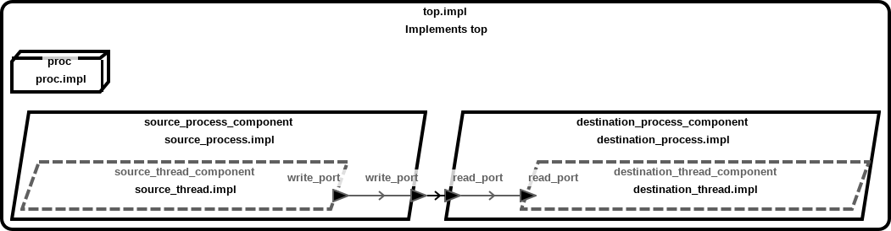
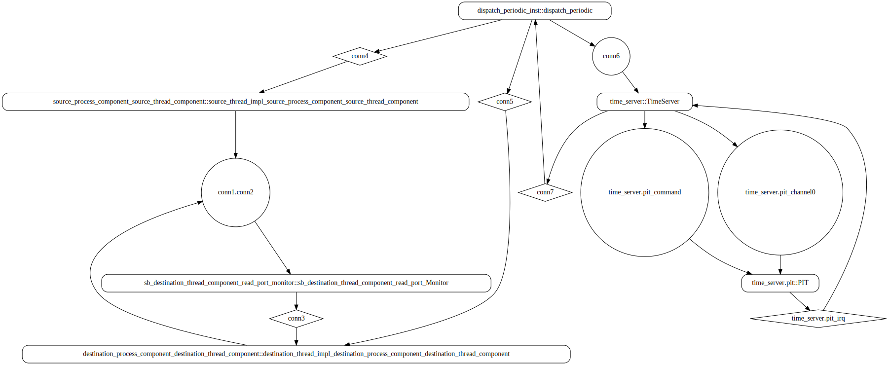
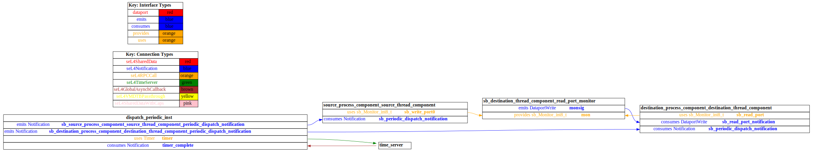
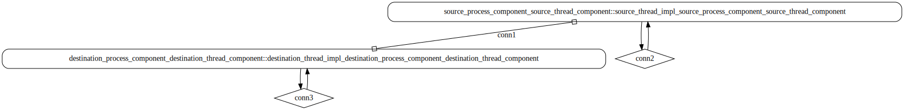
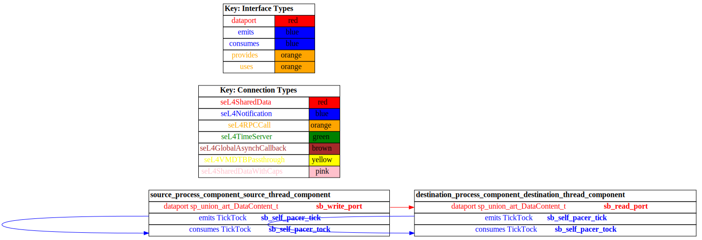

# test_data_port_periodic_domains

 Table of Contents
<!--table-of-contents_start-->
  * [AADL Architecture](#aadl-architecture)
  * [SeL4_TB](#sel4_tb)
    * [HAMR Configuration: SeL4_TB](#hamr-configuration-sel4_tb)
    * [Behavior Code: SeL4_TB](#behavior-code-sel4_tb)
    * [How to Build/Run: SeL4_TB](#how-to-buildrun-sel4_tb)
    * [Example Output: SeL4_TB](#example-output-sel4_tb)
    * [CAmkES Architecture: SeL4_TB](#camkes-architecture-sel4_tb)
    * [HAMR CAmkES Architecture: SeL4_TB](#hamr-camkes-architecture-sel4_tb)
  * [SeL4_Only](#sel4_only)
    * [HAMR Configuration: SeL4_Only](#hamr-configuration-sel4_only)
    * [Behavior Code: SeL4_Only](#behavior-code-sel4_only)
    * [How to Build/Run: SeL4_Only](#how-to-buildrun-sel4_only)
    * [Example Output: SeL4_Only](#example-output-sel4_only)
    * [CAmkES Architecture: SeL4_Only](#camkes-architecture-sel4_only)
    * [HAMR CAmkES Architecture: SeL4_Only](#hamr-camkes-architecture-sel4_only)
  * [SeL4](#sel4)
    * [HAMR Configuration: SeL4](#hamr-configuration-sel4)
    * [Behavior Code: SeL4](#behavior-code-sel4)
    * [How to Build/Run: SeL4](#how-to-buildrun-sel4)
    * [Example Output: SeL4](#example-output-sel4)
    * [CAmkES Architecture: SeL4](#camkes-architecture-sel4)
    * [HAMR CAmkES Architecture: SeL4](#hamr-camkes-architecture-sel4)
<!--table-of-contents_end-->


## AADL Architecture
<!--aadl-architecture_start-->

|System: [top_impl_Instance](aadl/test_data_port_periodic_domains.aadl#L99) Properties|
|--|
|Domain Scheduling|

|[source_thread_component](aadl/test_data_port_periodic_domains.aadl#L18) Properties|
|--|
|Native|
|Periodic: 1000 ms|
|Domain: 2|


|[destination_thread_component](aadl/test_data_port_periodic_domains.aadl#L53) Properties|
|--|
|Native|
|Periodic: 1000 ms|
|Domain: 3|


**Schedule:** [domain_schedule.c](aadl/behavior_code/kernel/domain_schedule.c)
<!--aadl-architecture_end-->


## SeL4_TB
<!--SeL4_TB_start--><!--SeL4_TB_end-->

### HAMR Configuration: SeL4_TB
<!--hamr-configuration-sel4_tb_start-->
To run HAMR Codegen, select [this](aadl/test_data_port_periodic_domains.aadl#L99) system implementation in FMIDE's outline view and then click the
HAMR button in the toolbar.  Use the following values in the dialog box that opens up (_&lt;example-dir&gt;_ is the directory that contains this readme file)

Option Name|Value |
|--|--|
Platform|SeL4_TB|
|seL4/CAmkES Output Directory|_&lt;example-dir&gt;_/hamr_seL4_TB/camkes

You can have HAMR's FMIDE plugin generate verbose output and run the transpiler by setting the ``Verbose output`` and ``Run Transpiler``
options that are located in __Preferences >> OSATE >> Sireum HAMR >> Code Generation__.


<details>

<summary>Click for instructions on how to run HAMR Codegen via the command line</summary>

The script [aadl/bin/run-hamr-SeL4_TB.sh](aadl/bin/run-hamr-SeL4_TB.sh) uses an experimental OSATE/FMIDE plugin we've developed that
allows you to run HAMR's OSATE/FMIDE plugin via the command line.  It has primarily been used/tested
when installed in OSATE (not FMIDE) and under Linux so may not work as expected in FMIDE or
under a different operating system. The script contains instructions on how to install the plugin.

```
./aadl/bin/run-hamr-SeL4_TB.sh <path-to-FMIDE-executable>
```

</details>
<!--hamr-configuration-sel4_tb_end-->


### Behavior Code: SeL4_TB
<!--behavior-code-sel4_tb_start-->
  * [source_thread_component](aadl/behavior_code/components/source/src/source.c)

  * [destination_thread_component](aadl/behavior_code/components/destination/src/destination.c)
<!--behavior-code-sel4_tb_end-->


### How to Build/Run: SeL4_TB
<!--how-to-buildrun-sel4_tb_start-->
```
./hamr_seL4_TB/camkes/bin/run-camkes.sh -s
```
<!--how-to-buildrun-sel4_tb_end-->


### Example Output: SeL4_TB
<!--example-output-sel4_tb_start-->
Timeout = 18 seconds
```
Booting all finished, dropped to user space
[source_process_component_source_thread_component] test_data_port_periodic_source_component_init called
[destination_process_component_destination_thread_component] test_data_port_periodic_domains_destination_component_init called
---------------------------------------
[source_process_component_source_thread_component] Sent 0
[destination_process_component_destination_thread_component] value {0}
---------------------------------------
[source_process_component_source_thread_component] Sent 1
[destination_process_component_destination_thread_component] value {1}
---------------------------------------
[source_process_component_source_thread_component] Sent 2
[destination_process_component_destination_thread_component] value {2}
---------------------------------------
[source_process_component_source_thread_component] Sent 3
[destination_process_component_destination_thread_component] value {3}
---------------------------------------
[source_process_component_source_thread_component] Sent 4
[destination_process_component_destination_thread_component] value {4}
---------------------------------------
[source_process_component_source_thread_component] Sent 5
[destination_process_component_destination_thread_component] value {5}
---------------------------------------
[source_process_component_source_thread_component] Sent 6
[destination_process_component_destination_thread_component] value {6}
---------------------------------------
[source_process_component_source_thread_component] Sent 7
[destination_process_component_destination_thread_component] value {7}
---------------------------------------
[source_process_component_source_thread_component] Sent 8
[destination_process_component_destination_thread_component] value {8}
---------------------------------------
[source_process_component_source_thread_component] Sent 9
[destination_process_component_destination_thread_component] value {9}

```
<!--example-output-sel4_tb_end-->


### CAmkES Architecture: SeL4_TB
<!--camkes-architecture-sel4_tb_start-->

<!--camkes-architecture-sel4_tb_end-->


### HAMR CAmkES Architecture: SeL4_TB
<!--hamr-camkes-architecture-sel4_tb_start-->

<!--hamr-camkes-architecture-sel4_tb_end-->


## SeL4_Only
<!--SeL4_Only_start--><!--SeL4_Only_end-->

### HAMR Configuration: SeL4_Only
<!--hamr-configuration-sel4_only_start-->
To run HAMR Codegen, select [this](aadl/test_data_port_periodic_domains.aadl#L99) system implementation in FMIDE's outline view and then click the
HAMR button in the toolbar.  Use the following values in the dialog box that opens up (_&lt;example-dir&gt;_ is the directory that contains this readme file)

Option Name|Value |
|--|--|
Platform|SeL4_Only|
|seL4/CAmkES Output Directory|_&lt;example-dir&gt;_/hamr_seL4_Only/camkes

You can have HAMR's FMIDE plugin generate verbose output and run the transpiler by setting the ``Verbose output`` and ``Run Transpiler``
options that are located in __Preferences >> OSATE >> Sireum HAMR >> Code Generation__.


<details>

<summary>Click for instructions on how to run HAMR Codegen via the command line</summary>

The script [aadl/bin/run-hamr-SeL4_Only.sh](aadl/bin/run-hamr-SeL4_Only.sh) uses an experimental OSATE/FMIDE plugin we've developed that
allows you to run HAMR's OSATE/FMIDE plugin via the command line.  It has primarily been used/tested
when installed in OSATE (not FMIDE) and under Linux so may not work as expected in FMIDE or
under a different operating system. The script contains instructions on how to install the plugin.

```
./aadl/bin/run-hamr-SeL4_Only.sh <path-to-FMIDE-executable>
```

</details>
<!--hamr-configuration-sel4_only_end-->


### Behavior Code: SeL4_Only
<!--behavior-code-sel4_only_start-->
  * [source_thread_component](aadl/behavior_code/components/source/src/source.c)

  * [destination_thread_component](aadl/behavior_code/components/destination/src/destination.c)
<!--behavior-code-sel4_only_end-->


### How to Build/Run: SeL4_Only
<!--how-to-buildrun-sel4_only_start-->
```
./hamr_seL4_Only/camkes/bin/run-camkes.sh -s
```
<!--how-to-buildrun-sel4_only_end-->


### Example Output: SeL4_Only
<!--example-output-sel4_only_start-->
Timeout = 18 seconds
```
Booting all finished, dropped to user space
[destination_process_component_destination_thread_component] test_data_port_periodic_domains_destination_component_init called
[source_process_component_source_thread_component] test_data_port_periodic_source_component_init called
---------------------------------------
[source_process_component_source_thread_component] Sent 0
[destination_process_component_destination_thread_component] value {0}
---------------------------------------
[source_process_component_source_thread_component] Sent 1
[destination_process_component_destination_thread_component] value {1}
---------------------------------------
[source_process_component_source_thread_component] Sent 2
[destination_process_component_destination_thread_component] value {2}
---------------------------------------
[source_process_component_source_thread_component] Sent 3
[destination_process_component_destination_thread_component] value {3}
---------------------------------------
[source_process_component_source_thread_component] Sent 4
[destination_process_component_destination_thread_component] value {4}
---------------------------------------
[source_process_component_source_thread_component] Sent 5
[destination_process_component_destination_thread_component] value {5}
---------------------------------------
[source_process_component_source_thread_component] Sent 6
[destination_process_component_destination_thread_component] value {6}
---------------------------------------
[source_process_component_source_thread_component] Sent 7
[destination_process_component_destination_thread_component] value {7}
---------------------------------------
[source_process_component_source_thread_component] Sent 8
[destination_process_component_destination_thread_component] value {8}
---------------------------------------
[source_process_component_source_thread_component] Sent 9
[destination_process_component_destination_thread_component] value {9}

```
<!--example-output-sel4_only_end-->


### CAmkES Architecture: SeL4_Only
<!--camkes-architecture-sel4_only_start-->

<!--camkes-architecture-sel4_only_end-->


### HAMR CAmkES Architecture: SeL4_Only
<!--hamr-camkes-architecture-sel4_only_start-->

<!--hamr-camkes-architecture-sel4_only_end-->


## SeL4
<!--SeL4_start--><!--SeL4_end-->

### HAMR Configuration: SeL4
<!--hamr-configuration-sel4_start-->
To run HAMR Codegen, select [this](aadl/test_data_port_periodic_domains.aadl#L99) system implementation in FMIDE's outline view and then click the
HAMR button in the toolbar.  Use the following values in the dialog box that opens up (_&lt;example-dir&gt;_ is the directory that contains this readme file)

Option Name|Value |
|--|--|
Platform|SeL4|
Output Directory|_&lt;example-dir&gt;_/hamr_seL4/slang|
Base Package Name|test_data_port_periodic_domains|
|Exclude Slang Component Implementations|True/Checked|
|Bit Width|32|
|Max Sequence Size|1|
|Max String Size|256|
|C Output Directory|_&lt;example-dir&gt;_/hamr_seL4/c|
|seL4/CAmkES Output Directory|_&lt;example-dir&gt;_/hamr_seL4/camkes

You can have HAMR's FMIDE plugin generate verbose output and run the transpiler by setting the ``Verbose output`` and ``Run Transpiler``
options that are located in __Preferences >> OSATE >> Sireum HAMR >> Code Generation__.


<details>

<summary>Click for instructions on how to run HAMR Codegen via the command line</summary>

The script [aadl/bin/run-hamr-SeL4.sh](aadl/bin/run-hamr-SeL4.sh) uses an experimental OSATE/FMIDE plugin we've developed that
allows you to run HAMR's OSATE/FMIDE plugin via the command line.  It has primarily been used/tested
when installed in OSATE (not FMIDE) and under Linux so may not work as expected in FMIDE or
under a different operating system. The script contains instructions on how to install the plugin.

```
./aadl/bin/run-hamr-SeL4.sh <path-to-FMIDE-executable>
```

</details>
<!--hamr-configuration-sel4_end-->


### Behavior Code: SeL4
<!--behavior-code-sel4_start-->
  * [source_thread_component](hamr_seL4/c/ext-c/source_thread_impl_source_process_component_source_thread_component/source_thread_impl_source_process_component_source_thread_component.c)

  * [destination_thread_component](hamr_seL4/c/ext-c/destination_thread_impl_destination_process_component_destination_thread_component/destination_thread_impl_destination_process_component_destination_thread_component.c)
<!--behavior-code-sel4_end-->


### How to Build/Run: SeL4
<!--how-to-buildrun-sel4_start-->
If you didn't configure HAMR's FMIDE plugin to run the transpiler automatically then run
```
./hamr_seL4/slang/bin/transpile-sel4.cmd
```
then

```
./hamr_seL4/camkes/bin/run-camkes.sh -s
```
<!--how-to-buildrun-sel4_end-->


### Example Output: SeL4
<!--example-output-sel4_start-->
Timeout = 18 seconds
```
Booting all finished, dropped to user space
Entering pre-init of destination_thread_impl_destination_process_cEntering pre-init of source_thread_impl_source_process_component_source_thread_component
omponent_destination_thread_component
Leaving pre-init of destination_thread_impl_destination_process_component_destination_thread_component
top_impl_Instance_source_process_component_source_thread_component: Initialized write port with: 0
Leaving pre-init of source_thread_impl_source_process_component_source_thread_component
top_impl_Instance_destination_process_component_destination_thread_component: Received 0 on data port read_port
top_impl_Instance_source_process_component_source_thread_component: Sent: 1
top_impl_Instance_destination_process_component_destination_thread_component: Received 1 on data port read_port
top_impl_Instance_source_process_component_source_thread_component: Sent: 2
top_impl_Instance_destination_process_component_destination_thread_component: Received 2 on data port read_port
top_impl_Instance_source_process_component_source_thread_component: Sent: 3
top_impl_Instance_destination_process_component_destination_thread_component: Received 3 on data port read_port
top_impl_Instance_source_process_component_source_thread_component: Sent: 4
top_impl_Instance_destination_process_component_destination_thread_component: Received 4 on data port read_port
top_impl_Instance_source_process_component_source_thread_component: Sent: 5
top_impl_Instance_destination_process_component_destination_thread_component: Received 5 on data port read_port
top_impl_Instance_source_process_component_source_thread_component: Sent: 6
top_impl_Instance_destination_process_component_destination_thread_component: Received 6 on data port read_port
top_impl_Instance_source_process_component_source_thread_component: Sent: 7
top_impl_Instance_destination_process_component_destination_thread_component: Received 7 on data port read_port
top_impl_Instance_source_process_component_source_thread_component: Sent: 8
top_impl_Instance_destination_process_component_destination_thread_component: Received 8 on data port read_port
top_impl_Instance_source_process_component_source_thread_component: Sent: 9
top_impl_Instance_destination_process_component_destination_thread_component: Received 9 on data port read_port

```
<!--example-output-sel4_end-->


### CAmkES Architecture: SeL4
<!--camkes-architecture-sel4_start-->

<!--camkes-architecture-sel4_end-->


### HAMR CAmkES Architecture: SeL4
<!--hamr-camkes-architecture-sel4_start-->

<!--hamr-camkes-architecture-sel4_end-->

