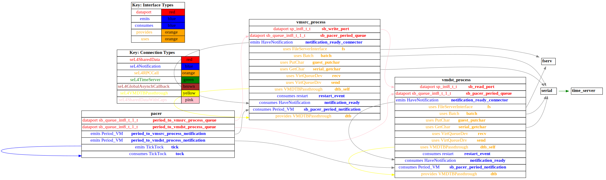
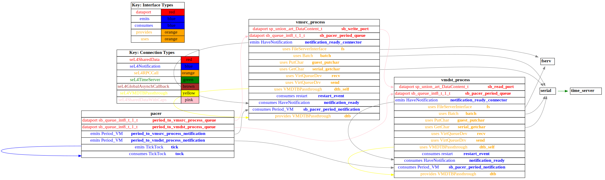

# both_vm

 Table of Contents
<!--table-of-contents_start-->
  * [AADL Architecture](#aadl-architecture)
  * [SeL4_Only](#sel4_only)
    * [HAMR Configuration: SeL4_Only](#hamr-configuration-sel4_only)
    * [Behavior Code: SeL4_Only](#behavior-code-sel4_only)
    * [How to Build/Run: SeL4_Only](#how-to-buildrun-sel4_only)
    * [Example Output: SeL4_Only](#example-output-sel4_only)
    * [CAmkES Architecture: SeL4_Only](#camkes-architecture-sel4_only)
    * [HAMR CAmkES Architecture: SeL4_Only](#hamr-camkes-architecture-sel4_only)
  * [SeL4](#sel4)
    * [HAMR Configuration: SeL4](#hamr-configuration-sel4)
    * [Behavior Code: SeL4](#behavior-code-sel4)
    * [How to Build/Run: SeL4](#how-to-buildrun-sel4)
    * [Example Output: SeL4](#example-output-sel4)
    * [CAmkES Architecture: SeL4](#camkes-architecture-sel4)
    * [HAMR CAmkES Architecture: SeL4](#hamr-camkes-architecture-sel4)
<!--table-of-contents_end-->


## AADL Architecture
<!--aadl-architecture_start-->

|System: [top_impl_Instance](aadl/test_data_port_periodic_domains.aadl#L95) Properties|
|--|
|Domain Scheduling|

|[src_thread](aadl/test_data_port_periodic_domains.aadl#L13) Properties|
|--|
|Virtual Machine|
|Periodic: 1000 ms|
|Domain: 2|


|[dst_thread](aadl/test_data_port_periodic_domains.aadl#L44) Properties|
|--|
|Virtual Machine|
|Periodic: 1000 ms|
|Domain: 3|


**Schedule:** [domain_schedule.c](aadl/behavior_code/kernel/domain_schedule.c)
<!--aadl-architecture_end-->


## SeL4_Only
<!--SeL4_Only_start--><!--SeL4_Only_end-->

### HAMR Configuration: SeL4_Only
<!--hamr-configuration-sel4_only_start-->
To run HAMR Codegen, select [this](aadl/test_data_port_periodic_domains.aadl#L95) system implementation in FMIDE's outline view and then click the
HAMR button in the toolbar.  Use the following values in the dialog box that opens up (_&lt;example-dir&gt;_ is the directory that contains this readme file)

Option Name|Value |
|--|--|
Platform|SeL4_Only|
|seL4/CAmkES Output Directory|_&lt;example-dir&gt;_/hamr_seL4_Only/camkes

You can have HAMR's FMIDE plugin generate verbose output and run the transpiler by setting the ``Verbose output`` and ``Run Transpiler``
options that are located in __Preferences >> OSATE >> Sireum HAMR >> Code Generation__.


<details>

<summary>Click for instructions on how to run HAMR Codegen via the command line</summary>

The script [aadl/bin/run-hamr-SeL4_Only.sh](aadl/bin/run-hamr-SeL4_Only.sh) uses an experimental OSATE/FMIDE plugin we've developed that
allows you to run HAMR's OSATE/FMIDE plugin via the command line.  It has primarily been used/tested
when installed in OSATE (not FMIDE) and under Linux so may not work as expected in FMIDE or
under a different operating system. The script contains instructions on how to install the plugin.

```
./aadl/bin/run-hamr-SeL4_Only.sh <path-to-FMIDE-executable>
```

</details>
<!--hamr-configuration-sel4_only_end-->


### Behavior Code: SeL4_Only
<!--behavior-code-sel4_only_start-->
  * [src_thread](aadl/behavior_code/components/emitter/src/emitter.c)

  * [dst_thread](aadl/behavior_code/components/consumer/src/consumer.c)
<!--behavior-code-sel4_only_end-->


### How to Build/Run: SeL4_Only
<!--how-to-buildrun-sel4_only_start-->
```
./hamr_seL4_Only/camkes/bin/run-camkes.sh -s
```
<!--how-to-buildrun-sel4_only_end-->


### Example Output: SeL4_Only
<!--example-output-sel4_only_start-->
Timeout = 90 seconds
```
Booting all finished, dropped to user space
<<seL4(CPU 0) [decodeUntypedInvocation/205 T0x80bf816400 "rootserver" @4006f8]: Untyped Retype: Insufficient memory (1 * 16777216 bytes needed, 0 bytes available).>>
<<seL4(CPU 0) [decodeUntypedInvocation/205 T0x80bf816400 "rootserver" @4006f8]: Untyped Retype: Insufficient memory (1 * 16777216 bytes needed, 0 bytes available).>>
<<seL4(CPU 0) [decodeUntypedInvocation/205 T0x80bf816400 "rootserver" @4006f8]: Untyped Retype: Insufficient memory (1 * 2097152 bytes needed, 0 bytes available).>>
<<seL4(CPU 0) [maskVMRights/187 T0x80bf816400 "rootserver" @4006f8]: Attempted to make unsupported write only mapping>>
<<seL4(CPU 0) [maskVMRights/187 T0x80bf816400 "rootserver" @4006f8]: Attempted to make unsupported write only mapping>>
_utspace_split_alloc@split.c:266 Failed to find any untyped capable of creating an object at address 0x8040000
Loading Linux: 'linux' dtb: ''
install_linux_devices@main.c:651 module name: map_frame_hack
install_linux_devices@main.c:651 module name: init_ram
_utspace_split_alloc@split.c:266 Failed to find any untyped capable of creating an object at address 0x8040000
Loading Linux: 'linux' dtb: ''
install_linux_devices@main.c:651 module name: map_frame_hack
install_linux_devices@main.c:651 module name: init_ram
install_linux_devices@main.c:651 module name: virtio_con
install_linux_devices@main.c:651 module name: cross_vm_connections
install_linux_devices@main.c:651 module name: virtio_con
install_linux_devices@main.c:651 module name: cross_vm_connections
libsel4muslcsys: Error attempting syscall 215
libsel4muslcsys: Error attempting syscall 215
libsel4muslcsys: Error attempting syscall 215
libsel4muslcsys: Error attempting syscall 215
clean_up@fdtgen.c:364 Non-existing node None specified to be kept
consume_connection_event@cross_vm_connection.c:241 Failed to inject connection irq
_utspace_split_alloc@split.c:266 Failed to find any untyped capable of creating an object at address 0x8020000
alloc_vm_device_cap@main.c:938 Grabbing the entire cap for device memory
alloc_vm_device_cap@main.c:941 Failed to grab the entire cap
clean_up@fdtgen.c:364 Non-existing node None specified to be kept
consume_connection_event@cross_vm_connection.c:241 Failed to inject connection irq
_utspace_split_alloc@split.c:266 Failed to find any untyped capable of creating an object at address 0x8020000
alloc_vm_device_cap@main.c:938 Grabbing the entire cap for device memory
alloc_vm_device_cap@main.c:941 Failed to grab the entire cap
consume_connection_event@cross_vm_connection.c:241 Failed to inject connection irq
consume_connection_event@cross_vm_connection.c:241 Failed to inject connection irq
consume_connection_event@cross_vm_connection.c:241 Failed to inject connection irq
consume_connection_event@cross_vm_connection.c:241 Failed to inject connection irq
consume_connection_event@cross_vm_connection.c:241 Failed to inject connection irq
[    4.412465] Unable to detect cache hierarchy for CPU 0
[    4.431792] e1000: Intel(R) PRO/1000 Network Driver - version 7.3.21-k8-NAPI
[    4.447965] e1000: Copyright (c) 1999-2006 Intel Corporation.
[    4.462168] e1000e: Intel(R) PRO/1000 Network Driver - 3.2.6-k
[    4.475773] e1000e: Copyright(c) 1999 - 2015 Intel Corporation.
[    4.496454] mousedev: PS/2 mouse device common for all mice
consume_connection_event@cross_vm_connection.c:241 Failed to inject connection irq
[    4.351747] Unable to detect cache hierarchy for CPU 0
[    4.366533] e1000: Intel(R) PRO/1000 Network Driver - version 7.3.21-k8-NAPI
[    4.380351] e1000: Copyright (c) 1999-2006 Intel Corporation.
[    4.392776] e1000e: Intel(R) PRO/1000 Network Driver - 3.2.6-k
[    4.406145] e1000e: Copyright(c) 1999 - 2015 Intel Corporation.
[    4.426000] mousedev: PS/2 mouse device common for all mice
[    4.449228] ledtrig-cpu: registered to indicate activity on CPUs
[    4.463444] dmi-sysfs: dmi entry is absent.
[    4.475451] ipip: IPv4 and MPLS over IPv4 tunneling driver
[    4.494330] NET: Registered protocol family 1[    5.306167] ledtrig-cpu: registered to indicate activity on CPUs
[    5.317673] dmi-sysfs: dmi entry is absent.
[    5.327771] ipip: IPv4 and MPLS over IPv4 tunneling driver
[    5.345993] NET: Registered protocol family 10
[    5.374100] mip6: Mobile IPv6
[    5.390264] NET: Registered protocol family 17
[    5.401603] mpls_gso: MPLS GSO support
[    5.410900] Registered cp15_barrier emulation handler
[    5.422410] Registered setend emulation handler
[    5.438138] registered taskstats version 1
[    5.449052] zswap: loaded using pool lzo/zbud
[    5.466226] ima: No TPM chip found, activating TPM-bypass!
[    5.477759] ima: Allocated hash algorithm: sha256
[    5.502551] hctosys: unable to open rtc device (rtc0)
[    5.515827] PM: Hibernation image not present or could not be loaded.
[    5.530012] initcall clk_disable_unused blacklisted
[    5.577017] Freeing unused kernel memory: 3776K
0
[    5.277515] mip6: Mobile IPv6
[    5.295543] NET: Registered protocol family 17
[    5.305788] mpls_gso: MPLS GSO support
[    5.316299] Registered cp15_barrier emulation handler
[    5.328581] Registered setend emulation handler
[    5.345735] registered taskstats version 1
[    5.355992] zswap: loaded using pool lzo/zbud
[    5.372538] ima: No TPM chip found, activating TPM-bypass!
[    5.384783] ima: Allocated hash algorithm: sha256
[    5.407986] hctosys: unable to open rtc device (rtc0)
[    5.420766] PM: Hibernation image not present or could not be loaded.
[    5.433055] initcall clk_disable_unused blacklisted
[    5.481308] Freeing unused kernel memory: 3776K
Starting syslogd: OK
Starting syslogd: OK
Starting klogd: Starting klogd: OK
Running sysctl: OK
Running sysctl: OK
OK
Initializing random number generator... [   10.934994] random: dd: uninitialized urandom read (512 bytes read)
Initializing random number generator... [   12.066705] random: dd: uninitialized urandom read (512 bytes read)
done.
Starting network: done.
Starting network: OK
[   13.626517] connection: loading out-of-tree module taints kernel.
[   13.669628] Event Bar (dev-0) initalised
[   13.685895] 2 Dataports (dev-0) initalised
[   13.712717] Event Bar (dev-1) initalised
[   13.722706] 2 Dataports (dev-1) initalised
OK
[   13.423277] connection: loading out-of-tree module taints kernel.
[   13.466237] Event Bar (dev-0) initalised
[   13.488507] 2 Dataports (dev-0) initalised
[   13.500861] Event Bar (dev-1) initalised
[   13.521549] 2 Dataports (dev-1) initalised

Welcome to Buildroot
buildroot login: 
Welcome to Buildroot
buildroot login: root
# vmsrc_process 
VM App vmsrc_process started
[vmsrc_process] test_data_port_emitter_component_init called
---------------------------------------
[vmsrc_process] Sent 0

Switching input to 1
---------------------------------------
[vmsrc_process] Sent 1
root
# ---------------------------------------
[vmsrc_process] Sent 2
# vmdst_process ---------------------------------------
[vmsrc_process] Sent 3

VM App vmdst_process started
[vmdst_process] test_data_port_consumer_component_init called
---------------------------------------
[vmsrc_process] Sent 4
[vmdst_process] value {4}
---------------------------------------
[vmsrc_process] Sent 5
[vmdst_process] value {5}
---------------------------------------
[vmsrc_process] Sent 6
[vmdst_process] value {6}
---------------------------------------
[vmsrc_process] Sent 7
[vmdst_process] value {7}
---------------------------------------
[vmsrc_process] Sent 8
[vmdst_process] value {8}
QEMU: Terminated
```
<!--example-output-sel4_only_end-->


### CAmkES Architecture: SeL4_Only
<!--camkes-architecture-sel4_only_start-->

<!--camkes-architecture-sel4_only_end-->


### HAMR CAmkES Architecture: SeL4_Only
<!--hamr-camkes-architecture-sel4_only_start-->

<!--hamr-camkes-architecture-sel4_only_end-->


## SeL4
<!--SeL4_start--><!--SeL4_end-->

### HAMR Configuration: SeL4
<!--hamr-configuration-sel4_start-->
To run HAMR Codegen, select [this](aadl/test_data_port_periodic_domains.aadl#L95) system implementation in FMIDE's outline view and then click the
HAMR button in the toolbar.  Use the following values in the dialog box that opens up (_&lt;example-dir&gt;_ is the directory that contains this readme file)

Option Name|Value |
|--|--|
Platform|SeL4|
Output Directory|_&lt;example-dir&gt;_/hamr_seL4/slang|
Base Package Name|both_vm|
|Exclude Slang Component Implementations|True/Checked|
|Bit Width|32|
|Max Sequence Size|1|
|Max String Size|256|
|C Output Directory|_&lt;example-dir&gt;_/hamr_seL4/c|
|seL4/CAmkES Output Directory|_&lt;example-dir&gt;_/hamr_seL4/camkes

You can have HAMR's FMIDE plugin generate verbose output and run the transpiler by setting the ``Verbose output`` and ``Run Transpiler``
options that are located in __Preferences >> OSATE >> Sireum HAMR >> Code Generation__.


<details>

<summary>Click for instructions on how to run HAMR Codegen via the command line</summary>

The script [aadl/bin/run-hamr-SeL4.sh](aadl/bin/run-hamr-SeL4.sh) uses an experimental OSATE/FMIDE plugin we've developed that
allows you to run HAMR's OSATE/FMIDE plugin via the command line.  It has primarily been used/tested
when installed in OSATE (not FMIDE) and under Linux so may not work as expected in FMIDE or
under a different operating system. The script contains instructions on how to install the plugin.

```
./aadl/bin/run-hamr-SeL4.sh <path-to-FMIDE-executable>
```

</details>
<!--hamr-configuration-sel4_end-->


### Behavior Code: SeL4
<!--behavior-code-sel4_start-->
  * [src_thread (includes VM glue code)](hamr_seL4/camkes/components/VM/apps/vmsrc_process/vmsrc_process.c)

  * [dst_thread (includes VM glue code)](hamr_seL4/camkes/components/VM/apps/vmdst_process/vmdst_process.c)
<!--behavior-code-sel4_end-->


### How to Build/Run: SeL4
<!--how-to-buildrun-sel4_start-->
If you didn't configure HAMR's FMIDE plugin to run the transpiler automatically then run
```
./hamr_seL4/slang/bin/transpile-sel4.cmd
```
then

```
./hamr_seL4/camkes/bin/run-camkes.sh -s
```
<!--how-to-buildrun-sel4_end-->


### Example Output: SeL4

**NOTE:** the sender VM must be started first so that the receiver's incoming read port is 
correctly initialized before it tries to read from it

<!--example-output-sel4_start-->
Timeout = 90 seconds
```
Booting all finished, dropped to user space
<<seL4(CPU 0) [decodeUntypedInvocation/205 T0x80bf816400 "rootserver" @4006f8]: Untyped Retype: Insufficient memory (1 * 16777216 bytes needed, 0 bytes available).>>
<<seL4(CPU 0) [decodeUntypedInvocation/205 T0x80bf816400 "rootserver" @4006f8]: Untyped Retype: Insufficient memory (1 * 16777216 bytes needed, 0 bytes available).>>
<<seL4(CPU 0) [decodeUntypedInvocation/205 T0x80bf816400 "rootserver" @4006f8]: Untyped Retype: Insufficient memory (1 * 2097152 bytes needed, 0 bytes available).>>
<<seL4(CPU 0) [maskVMRights/187 T0x80bf816400 "rootserver" @4006f8]: Attempted to make unsupported write only mapping>>
<<seL4(CPU 0) [maskVMRights/187 T0x80bf816400 "rootserver" @4006f8]: Attempted to make unsupported write only mapping>>
_utspace_split_alloc@split.c:266 Failed to find any untyped capable of creating an object at address 0x8040000
Loading Linux: 'linux' dtb: ''
install_linux_devices@main.c:651 module name: map_frame_hack
install_linux_devices@main.c:651 module name: init_ram
_utspace_split_alloc@split.c:266 Failed to find any untyped capable of creating an object at address 0x8040000
Loading Linux: 'linux' dtb: ''
install_linux_devices@main.c:651 module name: map_frame_hack
install_linux_devices@main.c:651 module name: init_ram
install_linux_devices@main.c:651 module name: virtio_con
install_linux_devices@main.c:651 module name: cross_vm_connections
install_linux_devices@main.c:651 module name: virtio_con
install_linux_devices@main.c:651 module name: cross_vm_connections
libsel4muslcsys: Error attempting syscall 215
libsel4muslcsys: Error attempting syscall 215
libsel4muslcsys: Error attempting syscall 215
clean_up@fdtgen.c:364 Non-existing node None specified to be kept
consume_connection_event@cross_vm_connection.c:241 Failed to inject connection irq
_utspace_split_alloc@split.c:266 Failed to find any untyped capable of creating an object at address 0x8020000
alloc_vm_device_cap@main.c:938 Grabbing the entire cap for device memory
alloc_vm_device_cap@main.c:941 Failed to grab the entire cap
libsel4muslcsys: Error attempting syscall 215
consume_connection_event@cross_vm_connection.c:241 Failed to inject connection irq
clean_up@fdtgen.c:364 Non-existing node None specified to be kept
consume_connection_event@cross_vm_connection.c:241 Failed to inject connection irq
_utspace_split_alloc@split.c:266 Failed to find any untyped capable of creating an object at address 0x8020000
alloc_vm_device_cap@main.c:938 Grabbing the entire cap for device memory
alloc_vm_device_cap@main.c:941 Failed to grab the entire cap
consume_connection_event@cross_vm_connection.c:241 Failed to inject connection irq
consume_connection_event@cross_vm_connection.c:241 Failed to inject connection irq
consume_connection_event@cross_vm_connection.c:241 Failed to inject connection irq
[    4.769279] Unable to detect cache hierarchy for CPU 0
[    4.789730] e1000: Intel(R) PRO/1000 Network Driver - version 7.3.21-k8-NAPI
[    4.804854] e1000: Copyright (c) 1999-2006 Intel Corporation.
[    4.818731] e1000e: Intel(R) PRO/1000 Network Driver - 3.2.6-k
[    4.831287] e1000e: Copyright(c) 1999 - 2015 Intel Corporation.
[    4.851160] mousedev: PS/2 mouse device commoconsume_connection_event@cross_vm_connection.c:241 Failed to inject connection irq
n for all mice
[    5.789938] ledtrig-cpu: registered to indicate activity on CPUs
[    5.803235] dmi-sysfs: dmi entry is absent.
[    5.815030] ipip: IPv4 and MPLS over IPv4 tunneling driver
[    5.831991] NET: Registered protocol family 10
[    5.858865] mip6: Mobile IPv6
[    5.875918] NET: Registered protocol family 17
[    5.888697] mpls_gso: MPLS GSO support
[    5.898372] Registered cp15_barrier emulation handler
[    5.909613] Registered setend emulation handler
[    5.927372] registered taskstats version 1
[    5.939183] zswap: loaded using pool lzo/zbud
[    5.956596] ima: No TPM chip found, activating TPM-bypass!
[    5.968819] ima: Allocated hash algorithm: sha256
[    5.990602] hctosys: unable to open rtc device (rtc0)
[    6.002937] PM: Hibernation image not present or could not be loaded.
[    6.016830] initcall clk_disable_unused blacklisted
[    6.066086] Freeing unused kernel memory: 3776K
consume_connection_event@cross_vm_connection.c:241 Failed to inject connection irq
[    4.360544] Unable to detect cache hierarchy for CPU 0
[    4.375886] e1000: Intel(R) PRO/1000 Network Driver - version 7.3.21-k8-NAPI
[    4.389867] e1000: Copyright (c) 1999-2006 Intel Corporation.
[    4.403029] e1000e: Intel(R) PRO/1000 Network Driver - 3.2.6-k
[    4.416557] e1000e: Copyright(c) 1999 - 2015 Intel Corporation.
[    4.436414] mousedev: PS/2 mouse device common for all mice
[    4.458018] ledtrig-cpu: registered to indicate activity on CPUs
[    4.472076] dmi-sysfs: dmi entry is absent.
[    4.481928] ipip: IPv4 and MPLS over IPv4 tunneling driver
[    4.500657] NET: Registered protocol family 10
[    5.396654] mip6: Mobile IPv6
[    5.412473] NET: Registered protocol family 17
[    5.422571] mpls_gso: MPLS GSO support
[    5.431009] Registered cp15_barrier emulation handler
[    5.441208] Registered setend emulation handler
[    5.457862] registered taskstats version 1
[    5.469479] zswap: loaded using pool lzo/zbud
[    5.484856] ima: No TPM chip found, activating TPM-bypass!
[    5.496425] ima: Allocated hash algorithm: sha256
[    5.518535] hctosys: unable to open rtc device (rtc0)
[    5.529737] PM: Hibernation image not present or could not be loaded.
[    5.543549] initcall clk_disable_unused blacklisted
[    5.590406] Freeing unused kernel memory: 3776K
Starting syslogd: OK
Starting klogd: OK
Running sysctl: Starting syslogd: OK
Starting klogd: OK
OK
Running sysctl: OK
Initializing random number generator... [   13.281792] random: dd: uninitialized urandom read (512 bytes read)
done.
Starting network: Initializing random number generator... [   11.628826] random: dd: uninitialized urandom read (512 bytes read)
done.
OK
Starting network: OK
[   15.821953] connection: loading out-of-tree module taints kernel.
[   15.870249] Event Bar (dev-0) initalised
[   15.890208] 2 Dataports (dev-0) initalised
[   15.910168] Event Bar (dev-1) initalised
[   15.933856] 2 Dataports (dev-1) initalised

Welcome to Buildroot
buildroot login: [   14.179854] connection: loading out-of-tree module taints kernel.
[   14.225253] Event Bar (dev-0) initalised
[   14.245390] 2 Dataports (dev-0) initalised
[   14.257979] Event Bar (dev-1) initalised
[   14.281051] 2 Dataports (dev-1) initalised

Welcome to Buildroot
buildroot login: root
# vmsrc_process 
VM App vmsrc_process started
Setting up outgoing data port /dev/uio0 4096
Successfully setup /dev/uio0
Setting up incoming event data port /dev/uio1 with size 4096
Successfully setup incoming event data port /dev/uio1
Hello from vmsrc_process's run method
[vmsrc_process] Sending {0} on write_port
[vmsrc_process] Sending {1} on write_port

Switching input to 1
[vmsrc_process] Sending {2} on write_port
[vmsrc_process] Sending {3} on write_port
[vmsrc_process] Sending {4} on write_port
[vmsrc_process] Sending {5} on write_port

Switching input to 1
[vmsrc_process] Sending {6} on write_port
root
# [vmsrc_process] Sending {7} on write_port
# vmdst_process [vmsrc_process] Sending {8} on write_port

VM App vmdst_process started
Setting up incoming data port /dev/uio0 with size 4096
Successfully setup incoming data port /dev/uio0
Setting up incoming event data port /dev/uio1 with size 4096
Successfully setup incoming event data port /dev/uio1
Hello from vmdst_process's run method
[vmdst_process] Received {8} on read_port
[vmsrc_process] Sending {9} on write_port
[vmdst_process] Received {9} on read_port
[vmsrc_process] Sending {10} on write_port
[vmdst_process] Received {10} on read_port
[vmsrc_process] Sending {11} on write_port
[vmdst_process] Received {11} on read_port
[vmsrc_process] Sending {12} on write_port
[vmdst_process] Received {12} on read_port
[vmsrc_process] Sending {13} on write_port
[vmdst_process] Received {13} on read_port
[vmsrc_process] Sending {14} on write_port
[vmdst_process] Received {14} on read_port
[vmsrc_process] Sending {15} on write_port
[vmdst_process] Received {15} on read_port
QEMU: Terminated
```
<!--example-output-sel4_end-->


### CAmkES Architecture: SeL4
<!--camkes-architecture-sel4_start-->

<!--camkes-architecture-sel4_end-->


### HAMR CAmkES Architecture: SeL4
<!--hamr-camkes-architecture-sel4_start-->

<!--hamr-camkes-architecture-sel4_end-->

