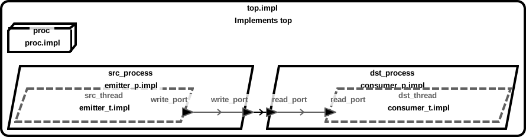
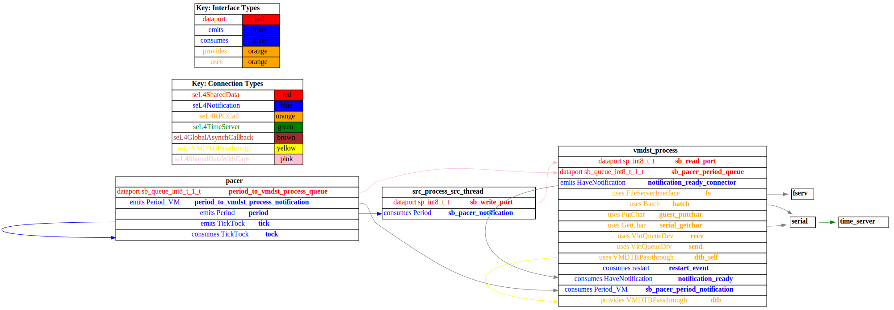

# receiver_vm

 Table of Contents
<!--table-of-contents_start-->
  * [AADL Architecture](#aadl-architecture)
  * [SeL4_Only](#sel4_only)
    * [HAMR Configuration: SeL4_Only](#hamr-configuration-sel4_only)
    * [Behavior Code: SeL4_Only](#behavior-code-sel4_only)
    * [How to Build/Run: SeL4_Only](#how-to-buildrun-sel4_only)
    * [Example Output: SeL4_Only](#example-output-sel4_only)
    * [CAmkES Architecture: SeL4_Only](#camkes-architecture-sel4_only)
    * [HAMR CAmkES Architecture: SeL4_Only](#hamr-camkes-architecture-sel4_only)
  * [SeL4](#sel4)
    * [HAMR Configuration: SeL4](#hamr-configuration-sel4)
    * [Behavior Code: SeL4](#behavior-code-sel4)
    * [How to Build/Run: SeL4](#how-to-buildrun-sel4)
    * [Example Output: SeL4](#example-output-sel4)
    * [CAmkES Architecture: SeL4](#camkes-architecture-sel4)
    * [HAMR CAmkES Architecture: SeL4](#hamr-camkes-architecture-sel4)
<!--table-of-contents_end-->


## AADL Architecture
<!--aadl-architecture_start-->

|System: [top_impl_Instance](aadl/test_data_port_periodic_domains.aadl#L95) Properties|
|--|
|Domain Scheduling|

|[src_thread](aadl/test_data_port_periodic_domains.aadl#L13) Properties|
|--|
|Native|
|Periodic: 1000 ms|
|Domain: 2|


|[dst_thread](aadl/test_data_port_periodic_domains.aadl#L44) Properties|
|--|
|Virtual Machine|
|Periodic: 1000 ms|
|Domain: 3|


**Schedule:** [domain_schedule.c](aadl/behavior_code/kernel/domain_schedule.c)
<!--aadl-architecture_end-->


## SeL4_Only
<!--SeL4_Only_start--><!--SeL4_Only_end-->

### HAMR Configuration: SeL4_Only
<!--hamr-configuration-sel4_only_start-->
To run HAMR Codegen, select [this](aadl/test_data_port_periodic_domains.aadl#L95) system implementation in FMIDE's outline view and then click the
HAMR button in the toolbar.  Use the following values in the dialog box that opens up (_&lt;example-dir&gt;_ is the directory that contains this readme file)

Option Name|Value |
|--|--|
Platform|SeL4_Only|
|seL4/CAmkES Output Directory|_&lt;example-dir&gt;_/hamr_seL4_Only/camkes

You can have HAMR's FMIDE plugin generate verbose output and run the transpiler by setting the ``Verbose output`` and ``Run Transpiler``
options that are located in __Preferences >> OSATE >> Sireum HAMR >> Code Generation__.


<details>

<summary>Click for instructions on how to run HAMR Codegen via the command line</summary>

The script [aadl/bin/run-hamr-SeL4_Only.sh](aadl/bin/run-hamr-SeL4_Only.sh) uses an experimental OSATE/FMIDE plugin we've developed that
allows you to run HAMR's OSATE/FMIDE plugin via the command line.  It has primarily been used/tested
when installed in OSATE (not FMIDE) and under Linux so may not work as expected in FMIDE or
under a different operating system. The script contains instructions on how to install the plugin.

```
./aadl/bin/run-hamr-SeL4_Only.sh <path-to-FMIDE-executable>
```

</details>
<!--hamr-configuration-sel4_only_end-->


### Behavior Code: SeL4_Only
<!--behavior-code-sel4_only_start-->
  * [src_thread](aadl/behavior_code/components/emitter/src/emitter.c)

  * [dst_thread](aadl/behavior_code/components/consumer/src/consumer.c)
<!--behavior-code-sel4_only_end-->


### How to Build/Run: SeL4_Only
<!--how-to-buildrun-sel4_only_start-->
```
./hamr_seL4_Only/camkes/bin/run-camkes.sh -s
```
<!--how-to-buildrun-sel4_only_end-->


### Example Output: SeL4_Only
<!--example-output-sel4_only_start-->
Timeout = 90 seconds
```
Booting all finished, dropped to user space
<<seL4(CPU 0) [decodeUntypedInvocation/205 T0x80bf815400 "rootserver" @4006f8]: Untyped Retype: Insufficient memory (1 * 2097152 bytes needed, 0 bytes available).>>
<<seL4(CPU 0) [maskVMRights/187 T0x80bf815400 "rootserver" @4006f8]: Attempted to make unsupported write only mapping>>
<<seL4(CPU 0) [maskVMRights/187 T0x80bf815400 "rootserver" @4006f8]: Attempted to make unsupported write only mapping>>
[src_process_src_thread] test_data_port_emitter_component_init called
_utspace_split_alloc@split.c:266 Failed to find any untyped capable of creating an object at address 0x8040000
Loading Linux: 'linux' dtb: ''
install_linux_devices@main.c:651 module name: map_frame_hack
install_linux_devices@main.c:651 module name: init_ram
---------------------------------------
[src_process_src_thread] Sent 0
---------------------------------------
[src_process_src_thread] Sent 1
---------------------------------------
[src_process_src_thread] Sent 2
---------------------------------------
[src_process_src_thread] Sent 3
install_linux_devices@main.c:651 module name: virtio_con
install_linux_devices@main.c:651 module name: cross_vm_connections
---------------------------------------
[src_process_src_thread] Sent 4
---------------------------------------
[src_process_src_thread] Sent 5
---------------------------------------
[src_process_src_thread] Sent 6
---------------------------------------
[src_process_src_thread] Sent 7
---------------------------------------
[src_process_src_thread] Sent 8
---------------------------------------
[src_process_src_thread] Sent 9
---------------------------------------
[src_process_src_thread] Sent 10
---------------------------------------
[src_process_src_thread] Sent 11
---------------------------------------
[src_process_src_thread] Sent 12
---------------------------------------
[src_process_src_thread] Sent 13
---------------------------------------
[src_process_src_thread] Sent 14
---------------------------------------
[src_process_src_thread] Sent 15
---------------------------------------
[src_process_src_thread] Sent 16
---------------------------------------
[src_process_src_thread] Sent 17
---------------------------------------
[src_process_src_thread] Sent 18
---------------------------------------
[src_process_src_thread] Sent 19
---------------------------------------
[src_process_src_thread] Sent 20
---------------------------------------
[src_process_src_thread] Sent 21
---------------------------------------
[src_process_src_thread] Sent 22
---------------------------------------
[src_process_src_thread] Sent 23
---------------------------------------
[src_process_src_thread] Sent 24
libsel4muslcsys: Error attempting syscall 215
---------------------------------------
[src_process_src_thread] Sent 25
---------------------------------------
[src_process_src_thread] Sent 26
---------------------------------------
[src_process_src_thread] Sent 27
---------------------------------------
[src_process_src_thread] Sent 28
---------------------------------------
[src_process_src_thread] Sent 29
---------------------------------------
[src_process_src_thread] Sent 30
---------------------------------------
[src_process_src_thread] Sent 31
---------------------------------------
[src_process_src_thread] Sent 32
---------------------------------------
[src_process_src_thread] Sent 33
---------------------------------------
[src_process_src_thread] Sent 34
libsel4muslcsys: Error attempting syscall 215
---------------------------------------
[src_process_src_thread] Sent 35
clean_up@fdtgen.c:364 Non-existing node None specified to be kept
consume_connection_event@cross_vm_connection.c:241 Failed to inject connection irq
_utspace_split_alloc@split.c:266 Failed to find any untyped capable of creating an object at address 0x8020000
alloc_vm_device_cap@main.c:938 Grabbing the entire cap for device memory
alloc_vm_device_cap@main.c:941 Failed to grab the entire cap
---------------------------------------
[src_process_src_thread] Sent 36
consume_connection_event@cross_vm_connection.c:241 Failed to inject connection irq
---------------------------------------
[src_process_src_thread] Sent 37
consume_connection_event@cross_vm_connection.c:241 Failed to inject connection irq
[    2.800470] Unable to detect cache hierarchy for CPU 0
[    2.823086] e1000: Intel(R) PRO/1000 Network Driver - version 7.3.21-k8-NAPI
[    2.840425] e1000: Copyright (c) 1999-2006 Intel Corporation.
[    2.856728] e1000e: Intel(R) PRO/1000 Network Driver - 3.2.6-k
[    2.872519] e1000e: Copyright(c) 1999 - 2015 Intel Corporation.
[    2.893708] mousedev: PS/2 mouse device common for all mice
[    2.917465] ledtrig-cpu: registered to indicate activity on CPUs
[    2.932613] dmi-sysfs: dmi entry is absent.
[    2.944900] ipip: IPv4 and MPLS over IPv4 tunnelin---------------------------------------
[src_process_src_thread] Sent 38
g driver
[    3.474647] NET: Registered protocol family 10
[    3.505499] mip6: Mobile IPv6
[    3.522927] NET: Registered protocol family 17
[    3.536631] mpls_gso: MPLS GSO support
[    3.547654] Registered cp15_barrier emulation handler
[    3.559943] Registered setend emulation handler
[    3.577871] registered taskstats version 1
[    3.589497] zswap: loaded using pool lzo/zbud
[    3.604980] ima: No TPM chip found, activating TPM-bypass!
[    3.617409] ima: Allocated hash algorithm: sha256
[    3.639887] hctosys: unable to open rtc device (rtc0)
[    3.653241] PM: Hibernation image not present or could not be loaded.
[    3.668691] initcall clk_disable_unused blacklisted
[    3.722790] Freeing unused kernel memory: 3776K
---------------------------------------
[src_process_src_thread] Sent 39
Starting syslogd: OK
Starting klogd: ---------------------------------------
[src_process_src_thread] Sent 40
OK
Running sysctl: ---------------------------------------
[src_process_src_thread] Sent 41
OK
Initializing random number generator... [    8.546701] random: dd: uninitialized urandom read (512 bytes read)
done.
Starting network: ---------------------------------------
[src_process_src_thread] Sent 42
OK
[    9.940777] connection: loading out-of-tree module taints kernel.
[    9.985706] Event Bar (dev-0) initalised
[   10.012795] 2 Dataports (dev-0) initalised
[   10.033303] Event Bar (dev-1) initalised
[   10.050701] 2 Dataports (dev-1) initalised
---------------------------------------
[src_process_src_thread] Sent 43

Welcome to Buildroot
buildroot login: ---------------------------------------
[src_process_src_thread] Sent 44
---------------------------------------
[src_process_src_thread] Sent 45
root
# ---------------------------------------
[src_process_src_thread] Sent 46
# vmdst_process ---------------------------------------
[src_process_src_thread] Sent 47

VM App vmdst_process started
[vmdst_process] test_data_port_consumer_component_init called
---------------------------------------
[src_process_src_thread] Sent 48
[vmdst_process] value {48}
---------------------------------------
[src_process_src_thread] Sent 49
[vmdst_process] value {49}
---------------------------------------
[src_process_src_thread] Sent 50
[vmdst_process] value {50}
---------------------------------------
[src_process_src_thread] Sent 51
[vmdst_process] value {51}
---------------------------------------
[src_process_src_thread] Sent 52
[vmdst_process] value {52}
---------------------------------------
[src_process_src_thread] Sent 53
[vmdst_process] value {53}
QEMU: Terminated
```
<!--example-output-sel4_only_end-->


### CAmkES Architecture: SeL4_Only
<!--camkes-architecture-sel4_only_start-->

<!--camkes-architecture-sel4_only_end-->


### HAMR CAmkES Architecture: SeL4_Only
<!--hamr-camkes-architecture-sel4_only_start-->

<!--hamr-camkes-architecture-sel4_only_end-->


## SeL4
<!--SeL4_start--><!--SeL4_end-->

### HAMR Configuration: SeL4
<!--hamr-configuration-sel4_start-->
To run HAMR Codegen, select [this](aadl/test_data_port_periodic_domains.aadl#L95) system implementation in FMIDE's outline view and then click the
HAMR button in the toolbar.  Use the following values in the dialog box that opens up (_&lt;example-dir&gt;_ is the directory that contains this readme file)

Option Name|Value |
|--|--|
Platform|SeL4|
Output Directory|_&lt;example-dir&gt;_/hamr_seL4/slang|
Base Package Name|receiver_vm|
|Exclude Slang Component Implementations|True/Checked|
|Bit Width|32|
|Max Sequence Size|1|
|Max String Size|256|
|C Output Directory|_&lt;example-dir&gt;_/hamr_seL4/c|
|seL4/CAmkES Output Directory|_&lt;example-dir&gt;_/hamr_seL4/camkes

You can have HAMR's FMIDE plugin generate verbose output and run the transpiler by setting the ``Verbose output`` and ``Run Transpiler``
options that are located in __Preferences >> OSATE >> Sireum HAMR >> Code Generation__.


<details>

<summary>Click for instructions on how to run HAMR Codegen via the command line</summary>

The script [aadl/bin/run-hamr-SeL4.sh](aadl/bin/run-hamr-SeL4.sh) uses an experimental OSATE/FMIDE plugin we've developed that
allows you to run HAMR's OSATE/FMIDE plugin via the command line.  It has primarily been used/tested
when installed in OSATE (not FMIDE) and under Linux so may not work as expected in FMIDE or
under a different operating system. The script contains instructions on how to install the plugin.

```
./aadl/bin/run-hamr-SeL4.sh <path-to-FMIDE-executable>
```

</details>
<!--hamr-configuration-sel4_end-->


### Behavior Code: SeL4
<!--behavior-code-sel4_start-->
  * [src_thread](hamr_seL4/c/ext-c/emitter_t_impl_src_process_src_thread/emitter_t_impl_src_process_src_thread.c)

  * [dst_thread (includes VM glue code)](hamr_seL4/camkes/components/VM/apps/vmdst_process/vmdst_process.c)
<!--behavior-code-sel4_end-->


### How to Build/Run: SeL4
<!--how-to-buildrun-sel4_start-->
If you didn't configure HAMR's FMIDE plugin to run the transpiler automatically then run
```
./hamr_seL4/slang/bin/transpile-sel4.cmd
```
then

```
./hamr_seL4/camkes/bin/run-camkes.sh -s
```
<!--how-to-buildrun-sel4_end-->


### Example Output: SeL4
<!--example-output-sel4_start-->
Timeout = 90 seconds
```
Booting all finished, dropped to user space
<<seL4(CPU 0) [decodeUntypedInvocation/205 T0x80bf816400 "rootserver" @4006c8]: Untyped Retype: Insufficient memory (1 * 2097152 bytes needed, 0 bytes available).>>
<<seL4(CPU 0) [maskVMRights/187 T0x80bf816400 "rootserver" @4006c8]: Attempted to make unsupported write only mapping>>
<<seL4(CPU 0) [maskVMRights/187 T0x80bf816400 "rootserver" @4006c8]: Attempted to make unsupported write only mapping>>
Entering pre-init of emitter_t_impl_src_process_src_thread
top_impl_Instance_src_process_src_thread: receiver_vm_test_data_port_periodic_domains_emitter_t_impl_src_process_src_thread_initialise_ called
Leaving pre-init of emitter_t_impl_src_process_src_thread
_utspace_split_alloc@split.c:266 Failed to find any untyped capable of creating an object at address 0x8040000
Loading Linux: 'linux' dtb: ''
install_linux_devices@main.c:651 module name: map_frame_hack
install_linux_devices@main.c:651 module name: init_ram
[top_impl_Instance_src_process_src_thread] emitting {1} on write_port
[top_impl_Instance_src_process_src_thread] emitting {2} on write_port
[top_impl_Instance_src_process_src_thread] emitting {3} on write_port
install_linux_devices@main.c:651 module name: virtio_con
install_linux_devices@main.c:651 module name: cross_vm_connections
[top_impl_Instance_src_process_src_thread] emitting {4} on write_port
[top_impl_Instance_src_process_src_thread] emitting {5} on write_port
[top_impl_Instance_src_process_src_thread] emitting {6} on write_port
[top_impl_Instance_src_process_src_thread] emitting {7} on write_port
[top_impl_Instance_src_process_src_thread] emitting {8} on write_port
[top_impl_Instance_src_process_src_thread] emitting {9} on write_port
[top_impl_Instance_src_process_src_thread] emitting {10} on write_port
[top_impl_Instance_src_process_src_thread] emitting {11} on write_port
[top_impl_Instance_src_process_src_thread] emitting {12} on write_port
[top_impl_Instance_src_process_src_thread] emitting {13} on write_port
[top_impl_Instance_src_process_src_thread] emitting {14} on write_port
[top_impl_Instance_src_process_src_thread] emitting {15} on write_port
[top_impl_Instance_src_process_src_thread] emitting {16} on write_port
[top_impl_Instance_src_process_src_thread] emitting {17} on write_port
[top_impl_Instance_src_process_src_thread] emitting {18} on write_port
[top_impl_Instance_src_process_src_thread] emitting {19} on write_port
[top_impl_Instance_src_process_src_thread] emitting {20} on write_port
[top_impl_Instance_src_process_src_thread] emitting {21} on write_port
[top_impl_Instance_src_process_src_thread] emitting {22} on write_port
[top_impl_Instance_src_process_src_thread] emitting {23} on write_port
[top_impl_Instance_src_process_src_thread] emitting {24} on write_port
libsel4muslcsys: Error attempting syscall 215
[top_impl_Instance_src_process_src_thread] emitting {25} on write_port
[top_impl_Instance_src_process_src_thread] emitting {26} on write_port
[top_impl_Instance_src_process_src_thread] emitting {27} on write_port
[top_impl_Instance_src_process_src_thread] emitting {28} on write_port
[top_impl_Instance_src_process_src_thread] emitting {29} on write_port
[top_impl_Instance_src_process_src_thread] emitting {30} on write_port
[top_impl_Instance_src_process_src_thread] emitting {31} on write_port
[top_impl_Instance_src_process_src_thread] emitting {32} on write_port
[top_impl_Instance_src_process_src_thread] emitting {33} on write_port
[top_impl_Instance_src_process_src_thread] emitting {34} on write_port
libsel4muslcsys: Error attempting syscall 215
[top_impl_Instance_src_process_src_thread] emitting {35} on write_port
clean_up@fdtgen.c:364 Non-existing node None specified to be kept
consume_connection_event@cross_vm_connection.c:241 Failed to inject connection irq
_utspace_split_alloc@split.c:266 Failed to find any untyped capable of creating an object at address 0x8020000
alloc_vm_device_cap@main.c:938 Grabbing the entire cap for device memory
alloc_vm_device_cap@main.c:941 Failed to grab the entire cap
[top_impl_Instance_src_process_src_thread] emitting {36} on write_port
consume_connection_event@cross_vm_connection.c:241 Failed to inject connection irq
[top_impl_Instance_src_process_src_thread] emitting {37} on write_port
consume_connection_event@cross_vm_connection.c:241 Failed to inject connection irq
[    2.865941] Unable to detect cache hierarchy for CPU 0
[    2.885337] e1000: Intel(R) PRO/1000 Network Driver - version 7.3.21-k8-NAPI
[    2.900526] e1000: Copyright (c) 1999-2006 Intel Corporation.
[    2.914028] e1000e: Intel(R) PRO/1000 Network Driver - 3.2.6-k
[    2.925302] e1000e: Copyright(c) 1999 - 2015 Intel Corporation.
[    2.944842] mousedev: PS/2 mouse device common for all mice
[    2.967595] ledtrig-cpu: registered to indicate activity on CPUs
[    2.980402] dmi-sysfs: dmi entry is absent.
[    2.993448] ipip: IPv4 and MPLS over IPv4 tunneling driver
[    3.012934] NET: Registered protocol family 10
[    3.041560] mip6: Mobile IPv6
[    3.055949] NET: Registered protocol family 17
[    3.068329] mpls_gso: MPLS GSO support
[    3.077865] Registered cp15_barrier emulation handler
[    3.087943] Registered setend emulation handler
[    3.105180] registered taskstats version 1
[    3.115982] zswap: loaded using pool lzo/zbud
[    3.131228] ima: No TPM chip found, activating TPM-bypass!
[    3.143925] ima: Allocated hash algorithm: sha256
[    3.164863] hctosys: unable to open rtc device (rtc0)
[    3.176771] PM: Hibernation image not present or could not be loaded.
[    3.189843] initcall clk_disable_unused blacklisted
[top_impl_Instance_src_process_src_thread] emitting {38} on write_port
[    4.056382] Freeing unused kernel memory: 3776K
[top_impl_Instance_src_process_src_thread] emitting {39} on write_port
Starting syslogd: OK
Starting klogd: OK
Running sysctl: [top_impl_Instance_src_process_src_thread] emitting {40} on write_port
[top_impl_Instance_src_process_src_thread] emitting {41} on write_port
OK
Initializing random number generator... [    9.076667] random: dd: uninitialized urandom read (512 bytes read)
done.
Starting network: [top_impl_Instance_src_process_src_thread] emitting {42} on write_port
OK
[   10.671158] connection: loading out-of-tree module taints kernel.
[   10.717725] Event Bar (dev-0) initalised
[   10.741666] 2 Dataports (dev-0) initalised
[   10.761541] Event Bar (dev-1) initalised
[   10.773994] 2 Dataports (dev-1) initalised

Welcome to Buildroot
buildroot login: [top_impl_Instance_src_process_src_thread] emitting {43} on write_port
[top_impl_Instance_src_process_src_thread] emitting {44} on write_port
root
# [top_impl_Instance_src_process_src_thread] emitting {45} on write_port
# vmdst_process [top_impl_Instance_src_process_src_thread] emitting {46} on write_port

VM App vmdst_process started
Setting up incoming data port /dev/uio0 with size 4096
Successfully setup incoming data port /dev/uio0
Setting up incoming event data port /dev/uio1 with size 4096
Successfully setup incoming event data port /dev/uio1
Hello from vmdst_process's run method
[vmdst_process] Received {46} on read_port
[top_impl_Instance_src_process_src_thread] emitting {47} on write_port
[vmdst_process] Received {47} on read_port
[top_impl_Instance_src_process_src_thread] emitting {48} on write_port
[vmdst_process] Received {48} on read_port
[top_impl_Instance_src_process_src_thread] emitting {49} on write_port
[vmdst_process] Received {49} on read_port
[top_impl_Instance_src_process_src_thread] emitting {50} on write_port
[vmdst_process] Received {50} on read_port
[top_impl_Instance_src_process_src_thread] emitting {51} on write_port
[vmdst_process] Received {51} on read_port
[top_impl_Instance_src_process_src_thread] emitting {52} on write_port
[vmdst_process] Received {52} on read_port
QEMU: Terminated
```
<!--example-output-sel4_end-->


### CAmkES Architecture: SeL4
<!--camkes-architecture-sel4_start-->

<!--camkes-architecture-sel4_end-->


### HAMR CAmkES Architecture: SeL4
<!--hamr-camkes-architecture-sel4_start-->

<!--hamr-camkes-architecture-sel4_end-->

