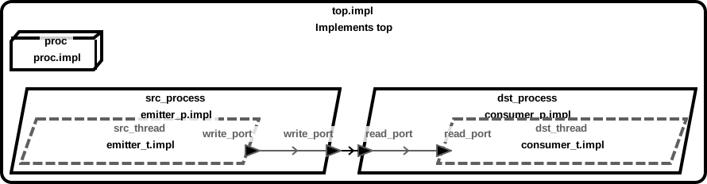
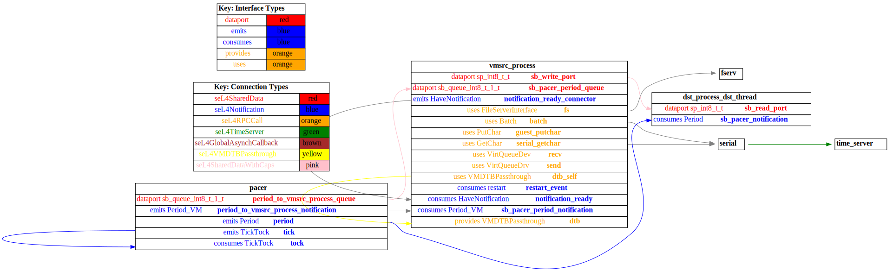

# sender_vm

 Table of Contents
<!--table-of-contents_start-->
  * [AADL Architecture](#aadl-architecture)
  * [SeL4_Only](#sel4_only)
    * [HAMR Configuration: SeL4_Only](#hamr-configuration-sel4_only)
    * [Behavior Code: SeL4_Only](#behavior-code-sel4_only)
    * [How to Build/Run: SeL4_Only](#how-to-buildrun-sel4_only)
    * [Example Output: SeL4_Only](#example-output-sel4_only)
    * [CAmkES Architecture: SeL4_Only](#camkes-architecture-sel4_only)
    * [HAMR CAmkES Architecture: SeL4_Only](#hamr-camkes-architecture-sel4_only)
<!--table-of-contents_end-->


## AADL Architecture
<!--aadl-architecture_start-->

|System: [top_impl_Instance](aadl/test_data_port_periodic_domains.aadl#L95) Properties|
|--|
|Domain Scheduling|

|[src_thread](aadl/test_data_port_periodic_domains.aadl#L13) Properties|
|--|
|Virtual Machine|
|Periodic: 1000 ms|
|Domain: 2|


|[dst_thread](aadl/test_data_port_periodic_domains.aadl#L44) Properties|
|--|
|Native|
|Periodic: 1000 ms|
|Domain: 3|


**Schedule:** [domain_schedule.c](aadl/behavior_code/kernel/domain_schedule.c)
<!--aadl-architecture_end-->


## SeL4_Only
<!--SeL4_Only_start--><!--SeL4_Only_end-->

### HAMR Configuration: SeL4_Only
<!--hamr-configuration-sel4_only_start-->
To run HAMR Codegen, select [this](aadl/test_data_port_periodic_domains.aadl#L95) system implementation in FMIDE's outline view and then click the
HAMR button in the toolbar.  Use the following values in the dialog box that opens up (_&lt;example-dir&gt;_ is the directory that contains this readme file)

Option Name|Value |
|--|--|
Platform|SeL4_Only|
|seL4/CAmkES Output Directory|_&lt;example-dir&gt;_/hamr_seL4_Only/camkes

You can have HAMR's FMIDE plugin generate verbose output and run the transpiler by setting the ``Verbose output`` and ``Run Transpiler``
options that are located in __Preferences >> OSATE >> Sireum HAMR >> Code Generation__.


<details>

<summary>Click for instructions on how to run HAMR Codegen via the command line</summary>

The script [aadl/bin/run-hamr-SeL4_Only.sh](aadl/bin/run-hamr-SeL4_Only.sh) uses an experimental OSATE/FMIDE plugin we've developed that
allows you to run HAMR's OSATE/FMIDE plugin via the command line.  It has primarily been used/tested
when installed in OSATE (not FMIDE) and under Linux so may not work as expected in FMIDE or
under a different operating system. The script contains instructions on how to install the plugin.

```
./aadl/bin/run-hamr-SeL4_Only.sh <path-to-FMIDE-executable>
```

</details>
<!--hamr-configuration-sel4_only_end-->


### Behavior Code: SeL4_Only
<!--behavior-code-sel4_only_start-->
  * [src_thread](aadl/behavior_code/components/emitter/src/emitter.c)

  * [dst_thread](aadl/behavior_code/components/consumer/src/consumer.c)
<!--behavior-code-sel4_only_end-->


### How to Build/Run: SeL4_Only
<!--how-to-buildrun-sel4_only_start-->
```
./hamr_seL4_Only/camkes/bin/run-camkes.sh -s
```
<!--how-to-buildrun-sel4_only_end-->


### Example Output: SeL4_Only
<!--example-output-sel4_only_start-->
Timeout = 90 seconds
```
Booting all finished, dropped to user space
<<seL4(CPU 0) [decodeUntypedInvocation/205 T0x80bf815400 "rootserver" @4006f8]: Untyped Retype: Insufficient memory (1 * 2097152 bytes needed, 0 bytes available).>>
<<seL4(CPU 0) [maskVMRights/187 T0x80bf815400 "rootserver" @4006f8]: Attempted to make unsupported write only mapping>>
_utspace_split_alloc@split.c:266 Failed to find any untyped capable of creating an object at address 0x8040000
Loading Linux: 'linux' dtb: ''
install_linux_devices@main.c:651 module name: map_frame_hack
install_linux_devices@main.c:651 module name: init_ram
[dst_process_dst_thread] test_data_port_consumer_component_init called
[dst_process_dst_thread] value {0}
[dst_process_dst_thread] value {0}
install_linux_devices@main.c:651 module name: virtio_con
install_linux_devices@main.c:651 module name: cross_vm_connections
[dst_process_dst_thread] value {0}
[dst_process_dst_thread] value {0}
[dst_process_dst_thread] value {0}
[dst_process_dst_thread] value {0}
[dst_process_dst_thread] value {0}
[dst_process_dst_thread] value {0}
[dst_process_dst_thread] value {0}
[dst_process_dst_thread] value {0}
[dst_process_dst_thread] value {0}
[dst_process_dst_thread] value {0}
[dst_process_dst_thread] value {0}
[dst_process_dst_thread] value {0}
[dst_process_dst_thread] value {0}
[dst_process_dst_thread] value {0}
[dst_process_dst_thread] value {0}
[dst_process_dst_thread] value {0}
[dst_process_dst_thread] value {0}
[dst_process_dst_thread] value {0}
[dst_process_dst_thread] value {0}
[dst_process_dst_thread] value {0}
[dst_process_dst_thread] value {0}
libsel4muslcsys: Error attempting syscall 215
[dst_process_dst_thread] value {0}
[dst_process_dst_thread] value {0}
[dst_process_dst_thread] value {0}
[dst_process_dst_thread] value {0}
[dst_process_dst_thread] value {0}
[dst_process_dst_thread] value {0}
[dst_process_dst_thread] value {0}
[dst_process_dst_thread] value {0}
[dst_process_dst_thread] value {0}
[dst_process_dst_thread] value {0}
libsel4muslcsys: Error attempting syscall 215
[dst_process_dst_thread] value {0}
clean_up@fdtgen.c:364 Non-existing node None specified to be kept
consume_connection_event@cross_vm_connection.c:241 Failed to inject connection irq
_utspace_split_alloc@split.c:266 Failed to find any untyped capable of creating an object at address 0x8020000
alloc_vm_device_cap@main.c:938 Grabbing the entire cap for device memory
alloc_vm_device_cap@main.c:941 Failed to grab the entire cap
[dst_process_dst_thread] value {0}
consume_connection_event@cross_vm_connection.c:241 Failed to inject connection irq
[dst_process_dst_thread] value {0}
consume_connection_event@cross_vm_connection.c:241 Failed to inject connection irq
[    3.168805] Unable to detect cache hierarchy for CPU 0
[    3.187277] e1000: Intel(R) PRO/1000 Network Driver - version 7.3.21-k8-NAPI
[    3.205025] e1000: Copyright (c) 1999-2006 Intel Corporation.
[    3.218523] e1000e: Intel(R) PRO/1000 Network Driver - 3.2.6-k
[    3.231334] e1000e: Copyright(c) 1999 - 2015 Intel Corporation.
[    3.250586] mousedev: PS/2 mouse device common for all mice
[    3.276658] ledtrig-cpu: registered to indicate activity on CPUs
[    3.293344] dmi-sysfs: dmi entry is absent.
[    3.306567] ipip: IPv4 and MPLS over IPv4 tunneling driver
[    3.326163] NET: Registered protocol family 10
[    3.357422] mip6: Mobile IPv6
[    3.375569] NET: Registered protocol family 17
[    3.386975] mpls_gso: MPLS GSO support
[    3.397746] Registered cp15_barrier emulation handler
[    3.409600] Registered setend emulation handler
[    3.427495] registered taskstats version 1
[    3.439180] zswap: loaded using pool lzo/zbud
[    3.457241] ima: No TPM chip found, activating TPM-bypass!
[    3.473755] ima: Allocated hash algorithm: sha256
[    3.497626] hctosys: unable to open rtc device (rtc0)
[    3.511071] PM: Hibernation image not present or could not be[dst_process_dst_thread] value {0}
 loaded.
[    4.337079] initcall clk_disable_unused blacklisted
[    4.385723] Freeing unused kernel memory: 3776K
[dst_process_dst_thread] value {0}
Starting syslogd: OK
Starting klogd: OK
Running sysctl: [dst_process_dst_thread] value {0}
OK
[dst_process_dst_thread] value {0}
Initializing random number generator... [    8.656094] random: dd: uninitialized urandom read (512 bytes read)
done.
Starting network: [dst_process_dst_thread] value {0}
OK
[   10.107111] connection: loading out-of-tree module taints kernel.
[   10.152903] Event Bar (dev-0) initalised
[   10.172480] 2 Dataports (dev-0) initalised
[   10.195665] Event Bar (dev-1) initalised
[   10.215013] 2 Dataports (dev-1) initalised

Welcome to Buildroot
buildroot login: [dst_process_dst_thread] value {0}

Welcome to Buildroot
buildroot login: [dst_process_dst_thread] value {0}
root[dst_process_dst_thread] value {0}

# [dst_process_dst_thread] value {0}
# vmsrc_process [dst_process_dst_thread] value {0}

VM App vmsrc_process started
[vmsrc_process] test_data_port_emitter_component_init called
---------------------------------------
[vmsrc_process] Sent 0
[dst_process_dst_thread] value {0}
---------------------------------------
[vmsrc_process] Sent 1
[dst_process_dst_thread] value {1}
---------------------------------------
[vmsrc_process] Sent 2
[dst_process_dst_thread] value {2}
---------------------------------------
[vmsrc_process] Sent 3
[dst_process_dst_thread] value {3}
---------------------------------------
[vmsrc_process] Sent 4
[dst_process_dst_thread] value {4}
---------------------------------------
[vmsrc_process] Sent 5
[dst_process_dst_thread] value {5}
---------------------------------------
[vmsrc_process] Sent 6
[dst_process_dst_thread] value {6}
---------------------------------------
[vmsrc_process] Sent 7
QEMU: Terminated
```
<!--example-output-sel4_only_end-->


### CAmkES Architecture: SeL4_Only
<!--camkes-architecture-sel4_only_start-->

<!--camkes-architecture-sel4_only_end-->


### HAMR CAmkES Architecture: SeL4_Only
<!--hamr-camkes-architecture-sel4_only_start-->

<!--hamr-camkes-architecture-sel4_only_end-->

