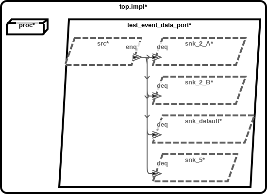
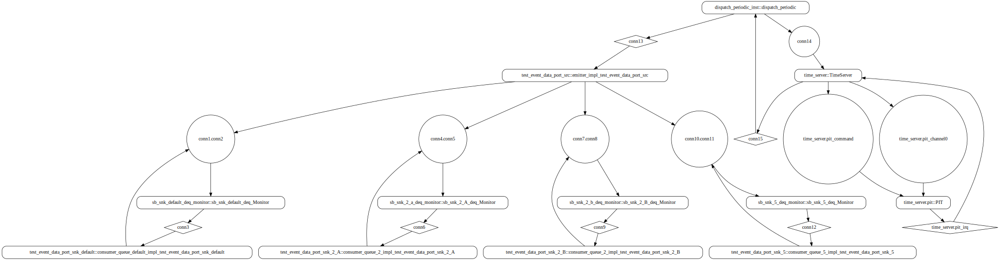
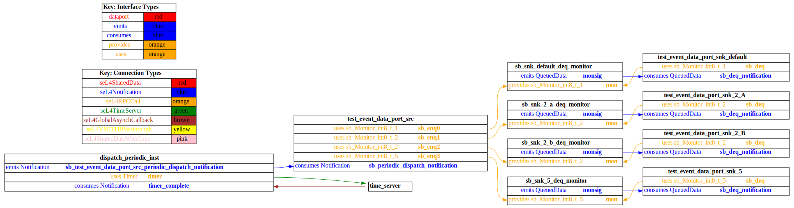
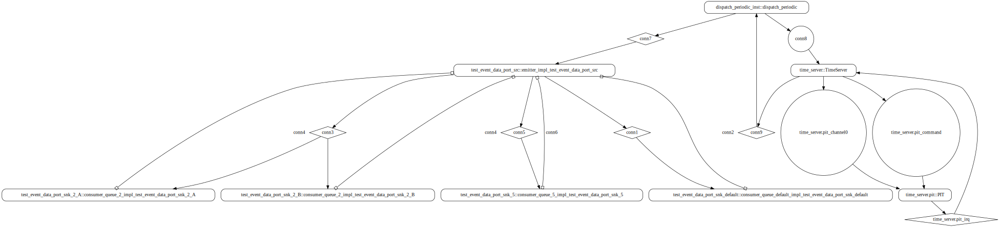
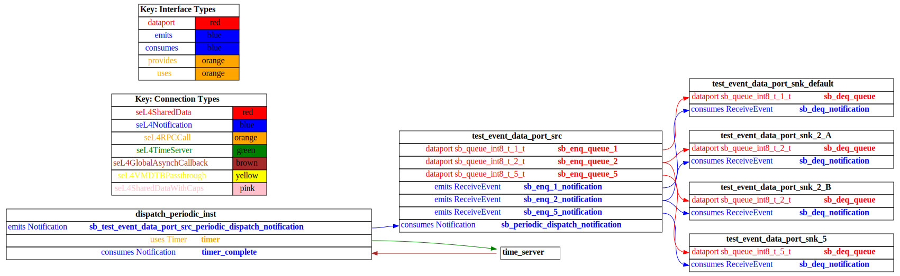

# test_event_data_port_fan_out

 Table of Contents
<!--table-of-contents_start-->
  * [AADL Architecture](#aadl-architecture)
  * [SeL4_TB](#sel4_tb)
    * [HAMR Configuration: SeL4_TB](#hamr-configuration-sel4_tb)
    * [Behavior Code: SeL4_TB](#behavior-code-sel4_tb)
    * [How to Build/Run: SeL4_TB](#how-to-buildrun-sel4_tb)
    * [Example Output: SeL4_TB](#example-output-sel4_tb)
    * [CAmkES Architecture: SeL4_TB](#camkes-architecture-sel4_tb)
    * [HAMR CAmkES Architecture: SeL4_TB](#hamr-camkes-architecture-sel4_tb)
  * [SeL4_Only](#sel4_only)
    * [HAMR Configuration: SeL4_Only](#hamr-configuration-sel4_only)
    * [Behavior Code: SeL4_Only](#behavior-code-sel4_only)
    * [How to Build/Run: SeL4_Only](#how-to-buildrun-sel4_only)
    * [Example Output: SeL4_Only](#example-output-sel4_only)
    * [CAmkES Architecture: SeL4_Only](#camkes-architecture-sel4_only)
    * [HAMR CAmkES Architecture: SeL4_Only](#hamr-camkes-architecture-sel4_only)
<!--table-of-contents_end-->


## AADL Architecture
<!--aadl-architecture_start-->

|System: [top_impl_Instance](aadl/test_event_data_port_fan_out.aadl#L90) Properties|
|--|
|Domain Scheduling|

|[src](aadl/test_event_data_port_fan_out.aadl#L6) Properties|
|--|
|Native|
|Periodic: 2000 ms|


|[snk_default](aadl/test_event_data_port_fan_out.aadl#L20) Properties|
|--|
|Native|
|Sporadic|


|[snk_2_A](aadl/test_event_data_port_fan_out.aadl#L34) Properties|
|--|
|Native|
|Sporadic|


|[snk_2_B](aadl/test_event_data_port_fan_out.aadl#L34) Properties|
|--|
|Native|
|Sporadic|


|[snk_5](aadl/test_event_data_port_fan_out.aadl#L49) Properties|
|--|
|Native|
|Sporadic|

<!--aadl-architecture_end-->


## SeL4_TB
<!--SeL4_TB_start--><!--SeL4_TB_end-->

### HAMR Configuration: SeL4_TB
<!--hamr-configuration-sel4_tb_start-->
To run HAMR Codegen, select [this](aadl/test_event_data_port_fan_out.aadl#L90) system implementation in FMIDE's outline view and then click the
HAMR button in the toolbar.  Use the following values in the dialog box that opens up (_&lt;example-dir&gt;_ is the directory that contains this readme file)

Option Name|Value |
|--|--|
Platform|SeL4_TB|
|seL4/CAmkES Output Directory|_&lt;example-dir&gt;_/hamr_seL4_TB/camkes

You can have HAMR's FMIDE plugin generate verbose output and run the transpiler by setting the ``Verbose output`` and ``Run Transpiler``
options that are located in __Preferences >> OSATE >> Sireum HAMR >> Code Generation__.


<details>

<summary>Click for instructions on how to run HAMR Codegen via the command line</summary>

The script [aadl/bin/run-hamr-SeL4_TB.sh](aadl/bin/run-hamr-SeL4_TB.sh) uses an experimental OSATE/FMIDE plugin we've developed that
allows you to run HAMR's OSATE/FMIDE plugin via the command line.  It has primarily been used/tested
when installed in OSATE (not FMIDE) and under Linux so may not work as expected in FMIDE or
under a different operating system. The script contains instructions on how to install the plugin.

```
./aadl/bin/run-hamr-SeL4_TB.sh <path-to-FMIDE-executable>
```

</details>
<!--hamr-configuration-sel4_tb_end-->


### Behavior Code: SeL4_TB
<!--behavior-code-sel4_tb_start-->
  * [src](aadl/behavior_code/components/emitter/src/emitter.c)

  * [snk_default](aadl/behavior_code/components/consumer/src/consumer_queue_default.c)

  * [snk_2_A](aadl/behavior_code/components/consumer/src/consumer_queue_2.c)

  * [snk_2_B](aadl/behavior_code/components/consumer/src/consumer_queue_2.c)

  * [snk_5](aadl/behavior_code/components/consumer/src/consumer_queue_5.c)
<!--behavior-code-sel4_tb_end-->


### How to Build/Run: SeL4_TB
<!--how-to-buildrun-sel4_tb_start-->
```
./hamr_seL4_TB/camkes/bin/run-camkes.sh -s
```
<!--how-to-buildrun-sel4_tb_end-->


### Example Output: SeL4_TB
<!--example-output-sel4_tb_start-->
Timeout = 18 seconds
```
Booting all finished, dropped to user space
[test_event_data_port_src] test_event_data_port_emitter_component_init called
[test_event_data_port_snk_default] test_event_data_port_consumer_component_init called
[test_event_data_port_snk_5] test_event_data_port_consumer_component_init called
[test_event_data_port_snk_2_B] test_event_data_port_consumer_component_init called
[test_event_data_port_snk_2_A] test_event_data_port_consumer_component_init called
---------------------------------------
[test_event_data_port_src] Sent 0 events.
---------------------------------------
[test_event_data_port_src] Sent 1 events.
[test_event_[test_event_data_port_[test_event_data_port_snk_default] received value {1}
[test_event_data_port_snk_default] 1 events received
data_port_snk_2_A] received value {1}
[test_event_data_port_snk_2_A] 1 events received
[test_event_data_port_snk_2_B] received value {1}
[test_event_data_port_snk_2_B] 1 events received
snk_5] received value {1}
[test_event_data_port_snk_5] 1 events received
---------------------------------------
[test_event_data_port_src] Sent 2 events.
[test_event_data_port_snk_default] received value {1}
[test_event_data_port_s[test_event_data_port_snk_2_A] received value {1}
[test_event_data_port_snk_2_A] received value {2}
[test_event_data_port_snk_2_A][test_event_data_port_snk_2_B] received value {1[test_event_data_port_snk_5] received value {1}
[testnk_default] 1 events received
 2 events received
}
[test_event_data_port_snk_2_B] received value {2}
[test_event_data_port_snk_2_B] 2 events received
_event_data_port_snk_5] received value {2}
[test_event_data_port_snk_5] 2 events received
---------------------------------------
[test_event_data_port_src] Sent 3 events.
[test_event_data_port_snk_default] received value {1}
[test_event_data_port_snk_default] 1 events received
[test_event_data_port_snk_2_A] received value {1}
[test_event_data_port_snk_2_A] received value {2}
[test_event_data_port_snk_2_A] 2 events received
[test_event_data_port_snk_2_B] received value {1}
[test_event_data_port_snk_2_B] received value {2}
[test_event_data_port_snk_2_B] 2 eve[test_event_data_port_snk_5] received value {1}
[test_event_data_port_snk_5] received value {2}
[test_event_data_port_snk_5] received value {3}
[test_event_data_nts received
port_snk_5] 3 events received
---------------------------------------
[test_event_data_port_src] Sent 4 events.
[test_event_data_port_snk_default] received value {1}
[test_event_data_port_snk_default] 1 events re[test_event_data_port_snk_2_A] received value {1}
[test_event_data_port_snk_2_A] received value {2}
[test_event_data_port_snk_2_A] 2 events received
[test_event_data_port_snk_2_B] received value {1}
[test_event_data_port_snk_2_B] received value {2}
[test_event_data_port_snk_2_B] 2 events received
[test_event_data_port_snk_5] received value {1}
[test_event_data_port_snk_5] received value {2}
[test_event_data_port_snk_5] received value {3}
[test_event_data_port_snk_5] received value {4}
[test_event_data_port_snk_5] 4 events received
ceived

```
<!--example-output-sel4_tb_end-->


### CAmkES Architecture: SeL4_TB
<!--camkes-architecture-sel4_tb_start-->

<!--camkes-architecture-sel4_tb_end-->


### HAMR CAmkES Architecture: SeL4_TB
<!--hamr-camkes-architecture-sel4_tb_start-->

<!--hamr-camkes-architecture-sel4_tb_end-->


## SeL4_Only
<!--SeL4_Only_start--><!--SeL4_Only_end-->

### HAMR Configuration: SeL4_Only
<!--hamr-configuration-sel4_only_start-->
To run HAMR Codegen, select [this](aadl/test_event_data_port_fan_out.aadl#L90) system implementation in FMIDE's outline view and then click the
HAMR button in the toolbar.  Use the following values in the dialog box that opens up (_&lt;example-dir&gt;_ is the directory that contains this readme file)

Option Name|Value |
|--|--|
Platform|SeL4_Only|
|seL4/CAmkES Output Directory|_&lt;example-dir&gt;_/hamr_seL4_Only/camkes

You can have HAMR's FMIDE plugin generate verbose output and run the transpiler by setting the ``Verbose output`` and ``Run Transpiler``
options that are located in __Preferences >> OSATE >> Sireum HAMR >> Code Generation__.


<details>

<summary>Click for instructions on how to run HAMR Codegen via the command line</summary>

The script [aadl/bin/run-hamr-SeL4_Only.sh](aadl/bin/run-hamr-SeL4_Only.sh) uses an experimental OSATE/FMIDE plugin we've developed that
allows you to run HAMR's OSATE/FMIDE plugin via the command line.  It has primarily been used/tested
when installed in OSATE (not FMIDE) and under Linux so may not work as expected in FMIDE or
under a different operating system. The script contains instructions on how to install the plugin.

```
./aadl/bin/run-hamr-SeL4_Only.sh <path-to-FMIDE-executable>
```

</details>
<!--hamr-configuration-sel4_only_end-->


### Behavior Code: SeL4_Only
<!--behavior-code-sel4_only_start-->
  * [src](aadl/behavior_code/components/emitter/src/emitter.c)

  * [snk_default](aadl/behavior_code/components/consumer/src/consumer_queue_default.c)

  * [snk_2_A](aadl/behavior_code/components/consumer/src/consumer_queue_2.c)

  * [snk_2_B](aadl/behavior_code/components/consumer/src/consumer_queue_2.c)

  * [snk_5](aadl/behavior_code/components/consumer/src/consumer_queue_5.c)
<!--behavior-code-sel4_only_end-->


### How to Build/Run: SeL4_Only
<!--how-to-buildrun-sel4_only_start-->
```
./hamr_seL4_Only/camkes/bin/run-camkes.sh -s
```
<!--how-to-buildrun-sel4_only_end-->


### Example Output: SeL4_Only
<!--example-output-sel4_only_start-->
Timeout = 18 seconds
```
Booting all finished, dropped to user space
[test_event_data_port_src] test_event_data_port_emitter_component_init called
[test_event_data_port_snk_default] test_event_data_port_consumer_component_init called
[test_event_data_port_snk_5] test_event_data_port_consumer_component_init called
[test_event_data_port_snk_2_B] test_event_data_port_consumer_component_init called
[test_event_data_port_snk_2_A] test_event_data_port_consumer_component_init called
---------------------------------------
[test_event_data_port_src] Sent 0 events.
---------------------------------------
[test_event_data_port_src] Sent 1 events.
[test_event_data_port_snk_default] receive[test_event_data_port_snk_2_A] received value {1}
[test_event_data_port_snk_2_A] 1 ev[test_event_data_port_snk_2_B] received value {1}
[test_event[test_event_data_port_snk_5] received value {1}
[test_event_data_port_snk_5] 1 events received
d value {1}
[test_event_data_port_snk_default] 1 events received
ents received
_data_port_snk_2_B] 1 events received
---------------------------------------
[test_event_data_port_src] Sent 2 events.
[test_event_data_port_snk_default] received value {2}
[test_event_data_port_snk_default] 1 events received
[test_event_data_port_snk_2_A] received value {1}
[test_event_data_port_snk_2_A] received value {2}
[test_event_data_port_snk_2_A] 2 events received
[test_event_data_port_snk_2_B] received value {1}
[test_event_data_port_snk_2_B] received value {2}
[test_event_data_port_snk_2_B] 2 events received
[test_event_data_port_snk_5] received value {1}
[test_event_data_port_snk_5] received value {2}
[test_event_data_port_snk_5] 2 events received
---------------------------------------
[test_event_data_port_src] Sent 3 events.
[test_event_data_port_snk_default] received value {3[test_event_data_port_snk_2_A] received value {2}
[test_event_data_port_snk_2_A] received value {3}
[test_event_data_port_snk_2_A] 2 events received
[test_event_data_port_snk_5] received value {1}
[test_event_data_port_snk_5] received value {2}
[test_event_data_port_snk_5] received value {3}
[test_event_data_port_snk_5] 3 events received
}
[test_event_data_port_snk_default] 1 events received
[test_event_data_port_snk_2_B] received value {2}
[test_event_data_port_snk_2_B] received value {3}
[test_event_data_port_snk_2_B] 2 events received
---------------------------------------
[test_event_data_port_src] Sent 4 events.
[test_event_data_port_snk_default] received value {4}
[test_event_data_port_snk_default] 1 events received
[test_event_data_port_snk_2_A] received value {3}
[test_event_data_port_snk_2_A] received value {4}
[test_event_data_port_snk_2_A[test_event_data_port_snk_2_B] received value {3}
[test_event_data_port_snk_2_B] received value {4}
[test_event_data_port_snk_2_B] 2 events received
[test_event_data_port_snk_5] received value {1}
[test_event_data_port_snk_5] received value {2}
[test_event_data_port_snk_5] received value {3}
[test_event_data_port_snk_5] received value {4}
[test_event_data_port_sn] 2 events received
k_5] 4 events received

```
<!--example-output-sel4_only_end-->


### CAmkES Architecture: SeL4_Only
<!--camkes-architecture-sel4_only_start-->

<!--camkes-architecture-sel4_only_end-->


### HAMR CAmkES Architecture: SeL4_Only
<!--hamr-camkes-architecture-sel4_only_start-->

<!--hamr-camkes-architecture-sel4_only_end-->

