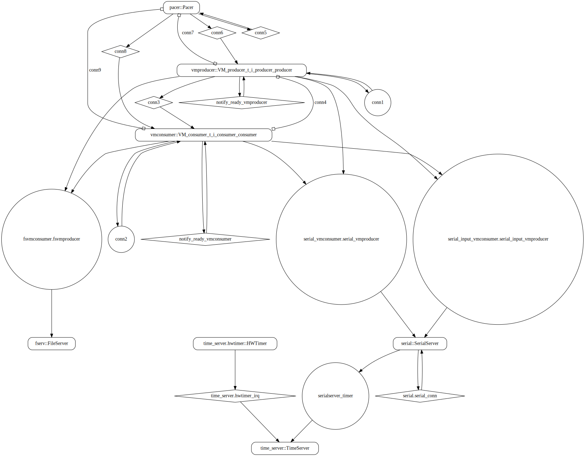

# both_vm

 Table of Contents
<!--table-of-contents_start-->
  * [AADL Architecture](#aadl-architecture)
  * [SeL4_Only](#sel4_only)
    * [HAMR Configuration: SeL4_Only](#hamr-configuration-sel4_only)
    * [Behavior Code: SeL4_Only](#behavior-code-sel4_only)
    * [How to Build/Run: SeL4_Only](#how-to-buildrun-sel4_only)
    * [Example Output: SeL4_Only](#example-output-sel4_only)
    * [CAmkES Architecture: SeL4_Only](#camkes-architecture-sel4_only)
    * [HAMR CAmkES Architecture: SeL4_Only](#hamr-camkes-architecture-sel4_only)
  * [SeL4](#sel4)
    * [HAMR Configuration: SeL4](#hamr-configuration-sel4)
    * [Behavior Code: SeL4](#behavior-code-sel4)
    * [How to Build/Run: SeL4](#how-to-buildrun-sel4)
    * [Example Output: SeL4](#example-output-sel4)
    * [CAmkES Architecture: SeL4](#camkes-architecture-sel4)
    * [HAMR CAmkES Architecture: SeL4](#hamr-camkes-architecture-sel4)
<!--table-of-contents_end-->


## AADL Architecture
<!--aadl-architecture_start-->

|System: [top_impl_Instance](aadl/test_event_data_port_periodic_domains.aadl#L95) Properties|
|--|
|Domain Scheduling|

|[src_thread](aadl/test_event_data_port_periodic_domains.aadl#L13) Properties|
|--|
|Virtual Machine|
|Periodic: 1000 ms|
|Domain: 2|


|[dst_thread](aadl/test_event_data_port_periodic_domains.aadl#L44) Properties|
|--|
|Virtual Machine|
|Periodic: 1000 ms|
|Domain: 3|


**Schedule:** [domain_schedule.c](aadl/behavior_code/kernel/domain_schedule.c)
<!--aadl-architecture_end-->


## SeL4_Only
<!--SeL4_Only_start--><!--SeL4_Only_end-->

### HAMR Configuration: SeL4_Only
<!--hamr-configuration-sel4_only_start-->
To run HAMR Codegen, select [this](aadl/test_event_data_port_periodic_domains.aadl#L95) system implementation in FMIDE's outline view and then click the
HAMR button in the toolbar.  Use the following values in the dialog box that opens up (_&lt;example-dir&gt;_ is the directory that contains this readme file)

Option Name|Value |
|--|--|
Platform|SeL4_Only|
|seL4/CAmkES Output Directory|_&lt;example-dir&gt;_/hamr_seL4_Only/camkes

You can have HAMR's FMIDE plugin generate verbose output and run the transpiler by setting the ``Verbose output`` and ``Run Transpiler``
options that are located in __Preferences >> OSATE >> Sireum HAMR >> Code Generation__.


<details>

<summary>Click for instructions on how to run HAMR Codegen via the command line</summary>

The script [aadl/bin/run-hamr-SeL4_Only.sh](aadl/bin/run-hamr-SeL4_Only.sh) uses an experimental OSATE/FMIDE plugin we've developed that
allows you to run HAMR's OSATE/FMIDE plugin via the command line.  It has primarily been used/tested
when installed in OSATE (not FMIDE) and under Linux so may not work as expected in FMIDE or
under a different operating system. The script contains instructions on how to install the plugin.

```
./aadl/bin/run-hamr-SeL4_Only.sh <path-to-FMIDE-executable>
```

</details>
<!--hamr-configuration-sel4_only_end-->


### Behavior Code: SeL4_Only
<!--behavior-code-sel4_only_start-->
  * [src_thread](aadl/behavior_code/components/emitter/src/emitter.c)

  * [dst_thread](aadl/behavior_code/components/consumer/src/consumer.c)
<!--behavior-code-sel4_only_end-->


### How to Build/Run: SeL4_Only
<!--how-to-buildrun-sel4_only_start-->
```
./hamr_seL4_Only/camkes/bin/run-camkes.sh -s
```
<!--how-to-buildrun-sel4_only_end-->


### Example Output: SeL4_Only
<!--example-output-sel4_only_start-->
Timeout = 90 seconds
```
Booting all finished, dropped to user space
<<seL4(CPU 0) [decodeUntypedInvocation/205 T0x80bf816400 "rootserver" @4006f8]: Untyped Retype: Insufficient memory (1 * 16777216 bytes needed, 0 bytes available).>>
<<seL4(CPU 0) [decodeUntypedInvocation/205 T0x80bf816400 "rootserver" @4006f8]: Untyped Retype: Insufficient memory (1 * 16777216 bytes needed, 0 bytes available).>>
<<seL4(CPU 0) [decodeUntypedInvocation/205 T0x80bf816400 "rootserver" @4006f8]: Untyped Retype: Insufficient memory (1 * 2097152 bytes needed, 0 bytes available).>>
<<seL4(CPU 0) [maskVMRights/187 T0x80bf816400 "rootserver" @4006f8]: Attempted to make unsupported write only mapping>>
<<seL4(CPU 0) [maskVMRights/187 T0x80bf816400 "rootserver" @4006f8]: Attempted to make unsupported write only mapping>>
_utspace_split_alloc@split.c:266 Failed to find any untyped capable of creating an object at address 0x8040000
Loading Linux: 'linux' dtb: ''
install_linux_devices@main.c:651 module name: map_frame_hack
install_linux_devices@main.c:651 module name: init_ram
_utspace_split_alloc@split.c:266 Failed to find any untyped capable of creating an object at address 0x8040000
Loading Linux: 'linux' dtb: ''
install_linux_devices@main.c:651 module name: map_frame_hack
install_linux_devices@main.c:651 module name: init_ram
install_linux_devices@main.c:651 module name: virtio_con
install_linux_devices@main.c:651 module name: cross_vm_connections
install_linux_devices@main.c:651 module name: virtio_con
install_linux_devices@main.c:651 module name: cross_vm_connections
libsel4muslcsys: Error attempting syscall 215
libsel4muslcsys: Error attempting syscall 215
libsel4muslcsys: Error attempting syscall 215
libsel4muslcsys: Error attempting syscall 215
clean_up@fdtgen.c:364 Non-existing node None specified to be kept
consume_connection_event@cross_vm_connection.c:241 Failed to inject connection irq
_utspace_split_alloc@split.c:266 Failed to find any untyped capable of creating an object at address 0x8020000
alloc_vm_device_cap@main.c:938 Grabbing the entire cap for device memory
alloc_vm_device_cap@main.c:941 Failed to grab the entire cap
clean_up@fdtgen.c:364 Non-existing node None specified to be kept
consume_connection_event@cross_vm_connection.c:241 Failed to inject connection irq
_utspace_split_alloc@split.c:266 Failed to find any untyped capable of creating an object at address 0x8020000
alloc_vm_device_cap@main.c:938 Grabbing the entire cap for device memory
alloc_vm_device_cap@main.c:941 Failed to grab the entire cap
consume_connection_event@cross_vm_connection.c:241 Failed to inject connection irq
consume_connection_event@cross_vm_connection.c:241 Failed to inject connection irq
consume_connection_event@cross_vm_connection.c:241 Failed to inject connection irq
consume_connection_event@cross_vm_connection.c:241 Failed to inject connection irq
consume_connection_event@cross_vm_connection.c:241 Failed to inject connection irq
[    4.388720] Unable to detect cache hierarchy for CPU 0
consume_connection_event@cross_vm_connection.c:241 Failed to inject connection irq
[    4.381897] Unable to detect cache hierarchy for CPU 0
[    4.396917] e1000: Intel(R) PRO/1000 Network Driver - version 7.3.21-k8-NAPI
[    4.411610] e1000: Copyright (c) 1999-2006 Intel Corporation.
[    4.425854] e1000e: Intel(R) PRO/1000 Network Driver - 3.2.6-k
[    5.292698] e1000: Intel(R) PRO/1000 Network Driver - version 7.3.21-k8-NAPI
[    5.307661] e1000: Copyright (c) 1999-2006 Intel Corporation.
[    5.324270] e1000e: Intel(R) PRO/1000 Network Driver - 3.2.6-k
[    5.340403] e1000e: Copyright(c) 1999 - 2015 Intel Corporation.
[    5.364011] mousedev: PS/2 mouse device common for all mice
[    5.389111] ledtrig-cpu: registered to indicate activity on CPUs
[    5.405277] dmi-sysfs: dmi entry is absent.
[    5.418045] ipip: IPv4 and MPLS over IPv4 tunneling driver
[    5.439215] NET: Registered protocol family 10
[    5.469505] mip6: Mobile IPv6
[    5.486365] NET: Registered protocol family 17
[    5.498425] mpls_gso: MPLS GSO support
[    5.508911] Registered cp15_barrier emulation handler
[    5.521335] Registered setend emulation handler
[    5.540611] registered taskstats version 1
[    5.553842] zswap: loaded using pool lzo/zbud
[    5.572175] ima: No TPM chip found, activating TPM-bypass!
[    5.585239] ima: Allocated hash algorithm: sha256
[    5.609212] hctosys: unable to open rtc device (rtc0)
[    5.624715] PM: Hibernation image not present or could not be loaded.
[    5.639718] initcall clk_disable_unused blacklisted
[    5.697156] Freeing unused kernel memory: 3776K
[    5.279286] e1000e: Copyright(c) 1999 - 2015 Intel Corporation.
[    5.302748] mousedev: PS/2 mouse device common for all mice
[    5.326419] ledtrig-cpu: registered to indicate activity on CPUs
[    5.341003] dmi-sysfs: dmi entry is absent.
[    5.353467] ipip: IPv4 and MPLS over IPv4 tunneling driver
[    5.374840] NET: Registered protocol family 10
[    5.410418] mip6: Mobile IPv6
[    5.429327] NET: Registered protocol family 17
[    5.441799] mpls_gso: MPLS GSO support
[    5.451277] Registered cp15_barrier emulation handler
[    5.463033] Registered setend emulation handler
[    5.480237] registered taskstats version 1
[    5.491499] zswap: loaded using pool lzo/zbud
[    5.510330] ima: No TPM chip found, activating TPM-bypass!
[    5.522249] ima: Allocated hash algorithm: sha256
[    5.544886] hctosys: unable to open rtc device (rtc0)
[    5.557807] PM: Hibernation image not present or could not be loaded.
[    5.571263] initcall clk_disable_unused blacklisted
[    5.621544] Freeing unused kernel memory: 3776K
Starting syslogd: OK
Starting syslogd: OK
Starting klogd: OK
Running sysctl: Starting klogd: OK
Running sysctl: OK
OK
Initializing random number generator... [   12.617903] random: dd: uninitialized urandom read (512 bytes read)
done.
Starting network: Initializing random number generator... [   12.518662] random: dd: uninitialized urandom read (512 bytes read)
done.
Starting network: OK
OK
[   14.106093] connection: loading out-of-tree module taints kernel.
[   14.154818] Event Bar (dev-0) initalised
[   14.167496] 2 Dataports (dev-0) initalised
[   14.197260] Event Bar (dev-1) initalised
[   15.046845] connection: loading out-of-tree module taints kernel.
[   15.089788] Event Bar (dev-0) initalised
[   15.102509] 2 Dataports (dev-0) initalised
[   15.135622] Event Bar (dev-1) initalised
[   15.160369] 2 Dataports (dev-1) initalised

Welcome to Buildroot
buildroot login: [   15.145978] 2 Dataports (dev-1) initalised

Welcome to Buildroot
buildroot login: root
# vmsrc_process 
VM App vmsrc_process started
[vmsrc_process] test_event_data_port_emitter_component_init called
[vmsrc_process] sending 0

Switching input to 1
[vmsrc_process] sending 1
root
# [vmsrc_process] sending 2
# vmdst_process [vmsrc_process] sending 3

VM App vmdst_process started
[vmdst_process] test_event_data_port_consumer_component_init called
[vmsrc_process] sending 4
[vmdst_process] received {4}
[vmsrc_process] sending 5
[vmdst_process] received {5}
[vmsrc_process] sending 6
[vmdst_process] received {6}
[vmsrc_process] sending 7
[vmdst_process] received {7}
[vmsrc_process] sending 8
[vmdst_process] received {8}
[vmsrc_process] sending 9
[vmdst_process] received {9}
QEMU: Terminated
```
<!--example-output-sel4_only_end-->


### CAmkES Architecture: SeL4_Only
<!--camkes-architecture-sel4_only_start-->

<!--camkes-architecture-sel4_only_end-->


### HAMR CAmkES Architecture: SeL4_Only
<!--hamr-camkes-architecture-sel4_only_start-->

<!--hamr-camkes-architecture-sel4_only_end-->


## SeL4
<!--SeL4_start--><!--SeL4_end-->

### HAMR Configuration: SeL4
<!--hamr-configuration-sel4_start-->
To run HAMR Codegen, select [this](aadl/test_event_data_port_periodic_domains.aadl#L95) system implementation in FMIDE's outline view and then click the
HAMR button in the toolbar.  Use the following values in the dialog box that opens up (_&lt;example-dir&gt;_ is the directory that contains this readme file)

Option Name|Value |
|--|--|
Platform|SeL4|
Output Directory|_&lt;example-dir&gt;_/hamr_seL4/slang|
Base Package Name|both_vm|
|Exclude Slang Component Implementations|True/Checked|
|Bit Width|32|
|Max Sequence Size|1|
|Max String Size|256|
|C Output Directory|_&lt;example-dir&gt;_/hamr_seL4/c|
|seL4/CAmkES Output Directory|_&lt;example-dir&gt;_/hamr_seL4/camkes

You can have HAMR's FMIDE plugin generate verbose output and run the transpiler by setting the ``Verbose output`` and ``Run Transpiler``
options that are located in __Preferences >> OSATE >> Sireum HAMR >> Code Generation__.


<details>

<summary>Click for instructions on how to run HAMR Codegen via the command line</summary>

The script [aadl/bin/run-hamr-SeL4.sh](aadl/bin/run-hamr-SeL4.sh) uses an experimental OSATE/FMIDE plugin we've developed that
allows you to run HAMR's OSATE/FMIDE plugin via the command line.  It has primarily been used/tested
when installed in OSATE (not FMIDE) and under Linux so may not work as expected in FMIDE or
under a different operating system. The script contains instructions on how to install the plugin.

```
./aadl/bin/run-hamr-SeL4.sh <path-to-FMIDE-executable>
```

</details>
<!--hamr-configuration-sel4_end-->


### Behavior Code: SeL4
<!--behavior-code-sel4_start-->
  * [src_thread (includes VM glue code)](hamr_seL4/camkes/components/VM/apps/vmsrc_process/vmsrc_process.c)

  * [dst_thread (includes VM glue code)](hamr_seL4/camkes/components/VM/apps/vmdst_process/vmdst_process.c)
<!--behavior-code-sel4_end-->


### How to Build/Run: SeL4
<!--how-to-buildrun-sel4_start-->
If you didn't configure HAMR's FMIDE plugin to run the transpiler automatically then run
```
./hamr_seL4/slang/bin/transpile-sel4.cmd
```
then

```
./hamr_seL4/camkes/bin/run-camkes.sh -s
```
<!--how-to-buildrun-sel4_end-->


### Example Output: SeL4
<!--example-output-sel4_start-->
Timeout = 90 seconds
```
Booting all finished, dropped to user space
<<seL4(CPU 0) [decodeUntypedInvocation/205 T0x80bf816400 "rootserver" @4006f8]: Untyped Retype: Insufficient memory (1 * 16777216 bytes needed, 0 bytes available).>>
<<seL4(CPU 0) [decodeUntypedInvocation/205 T0x80bf816400 "rootserver" @4006f8]: Untyped Retype: Insufficient memory (1 * 16777216 bytes needed, 0 bytes available).>>
<<seL4(CPU 0) [decodeUntypedInvocation/205 T0x80bf816400 "rootserver" @4006f8]: Untyped Retype: Insufficient memory (1 * 2097152 bytes needed, 0 bytes available).>>
<<seL4(CPU 0) [maskVMRights/187 T0x80bf816400 "rootserver" @4006f8]: Attempted to make unsupported write only mapping>>
<<seL4(CPU 0) [maskVMRights/187 T0x80bf816400 "rootserver" @4006f8]: Attempted to make unsupported write only mapping>>
_utspace_split_alloc@split.c:266 Failed to find any untyped capable of creating an object at address 0x8040000
Loading Linux: 'linux' dtb: ''
install_linux_devices@main.c:651 module name: map_frame_hack
install_linux_devices@main.c:651 module name: init_ram
_utspace_split_alloc@split.c:266 Failed to find any untyped capable of creating an object at address 0x8040000
Loading Linux: 'linux' dtb: ''
install_linux_devices@main.c:651 module name: map_frame_hack
install_linux_devices@main.c:651 module name: init_ram
install_linux_devices@main.c:651 module name: virtio_con
install_linux_devices@main.c:651 module name: cross_vm_connections
install_linux_devices@main.c:651 module name: virtio_con
install_linux_devices@main.c:651 module name: cross_vm_connections
libsel4muslcsys: Error attempting syscall 215
libsel4muslcsys: Error attempting syscall 215
libsel4muslcsys: Error attempting syscall 215
libsel4muslcsys: Error attempting syscall 215
clean_up@fdtgen.c:364 Non-existing node None specified to be kept
consume_connection_event@cross_vm_connection.c:241 Failed to inject connection irq
_utspace_split_alloc@split.c:266 Failed to find any untyped capable of creating an object at address 0x8020000
alloc_vm_device_cap@main.c:938 Grabbing the entire cap for device memory
alloc_vm_device_cap@main.c:941 Failed to grab the entire cap
clean_up@fdtgen.c:364 Non-existing node None specified to be kept
consume_connection_event@cross_vm_connection.c:241 Failed to inject connection irq
_utspace_split_alloc@split.c:266 Failed to find any untyped capable of creating an object at address 0x8020000
alloc_vm_device_cap@main.c:938 Grabbing the entire cap for device memory
alloc_vm_device_cap@main.c:941 Failed to grab the entire cap
consume_connection_event@cross_vm_connection.c:241 Failed to inject connection irq
consume_connection_event@cross_vm_connection.c:241 Failed to inject connection irq
consume_connection_event@cross_vm_connection.c:241 Failed to inject connection irq
consume_connection_event@cross_vm_connection.c:241 Failed to inject connection irq
consume_connection_event@cross_vm_connection.c:241 Failed to inject connection irq
consume_connection_event@cross_vm_connection.c:241 Failed to inject connection irq
[    4.258655] Unable to detect cache hierarchy for CPU 0
[    4.272787] e1000: Intel(R) P[    5.088327] Unable to detect cache hierarchy for CPU 0
[    5.106547] e1000: Intel(R) PRO/1000 Network Driver - version 7.3.21-k8-NAPI
[    5.123391] e1000: Copyright (c) 1999-2006 Intel Corporation.
[    5.136415] e1000e: Intel(R) PRO/1000 Network Driver - 3.2.6-k
[    5.149285] e1000e: Copyright(c) 1999 - 2015 Intel Corporation.
[    5.172068] mousedev: PS/2 mouse device common for all mice
[    5.192487] ledtrig-cpu: registered to indicate activity on CPUs
[    5.206859] dmi-sysfs: dmi entry is absent.
[    5.219030] ipip: IPv4 and MPLS over IPv4 tunneling driver
[    5.237722] NET: Registered protocol family 10
[    5.267296] mip6: Mobile IPv6
[    5.284095] NET: Registered protocol family 17
[    5.298051] mpls_gso: MPLS GSO support
[    5.307305] Registered cp15_barrier emulation handler
[    5.318342] Registered setend emulation handler
[    5.337588] registered taskstats version 1
[    5.347406] zswap: loaded using pool lzo/zbud
[    5.363553] ima: No TPM chip found, activating TPM-bypass!
[    5.375451] ima: Allocated hash algorithm: sha256
[    5.400488] hctosys: unable to open rtc device (rtc0)
[    5.411870] PM: Hibernation image not present or could not be loaded.
[    5.425463] initcall clk_disable_unused blacklisted
[    5.475241] Freeing unused kernel memory: 3776K
RO/1000 Network Driver - version 7.3.21-k8-NAPI
[    5.079547] e1000: Copyright (c) 1999-2006 Intel Corporation.
[    5.094234] e1000e: Intel(R) PRO/1000 Network Driver - 3.2.6-k
[    5.108437] e1000e: Copyright(c) 1999 - 2015 Intel Corporation.
[    5.128788] mousedev: PS/2 mouse device common for all mice
[    5.149505] ledtrig-cpu: registered to indicate activity on CPUs
[    5.164506] dmi-sysfs: dmi entry is absent.
[    5.175162] ipip: IPv4 and MPLS over IPv4 tunneling driver
[    5.193541] NET: Registered protocol family 10
[    5.224177] mip6: Mobile IPv6
[    5.239832] NET: Registered protocol family 17
[    5.252187] mpls_gso: MPLS GSO support
[    5.261578] Registered cp15_barrier emulation handler
[    5.272180] Registered setend emulation handler
[    5.291015] registered taskstats version 1
[    5.300788] zswap: loaded using pool lzo/zbud
[    5.319260] ima: No TPM chip found, activating TPM-bypass!
[    5.332268] ima: Allocated hash algorithm: sha256
[    5.352800] hctosys: unable to open rtc device (rtc0)
[    5.367939] PM: Hibernation image not present or could not be loaded.
[    5.381782] initcall clk_disable_unused blacklisted
[    5.431882] Freeing unused kernel memory: 3776K
Starting syslogd: OK
Starting syslogd: OK
Starting klogd: Starting klogd: OK
Running sysctl: OK
Running sysctl: OK
OK
Initializing random number generator... [   12.307114] random: dd: uninitialized urandom read (512 bytes read)
done.
Starting network: Initializing random number generator... [   12.351554] random: dd: uninitialized urandom read (512 bytes read)
done.
Starting network: OK
[   13.870052] connection: loading out-of-tree module taints kernel.
[   13.915301] Event Bar (dev-0) initalised
[   13.941694] 2 Dataports (dev-0) initalised
[   13.959764] Event Bar (dev-1) initalised
[   13.977418] 2 Dataports (dev-1) initalised
OK
[   13.905360] connection: loading out-of-tree module taints kernel.
[   13.948822] Event Bar (dev-0) initalised
[   13.972090] 2 Dataports (dev-0) initalised
[   13.993565] Event Bar (dev-1) initalised
[   14.004965] 2 Dataports (dev-1) initalised

Welcome to Buildroot
buildroot login: 
Welcome to Buildroot
buildroot login: root
# vmsrc_process 
VM App vmsrc_process started
Setting up outgoing event data port /dev/uio0 4096
Successfully setup /dev/uio0
Setting up incoming event data port /dev/uio1 with size 4096
Successfully setup incoming event data port /dev/uio1
Hello from vmsrc_process's run method
[vmsrc_process] Sending {0} on write_port
[vmsrc_process] Sending {1} on write_port

Switching input to 1
[vmsrc_process] Sending {2} on write_port
root[vmsrc_process] Sending {3} on write_port

# [vmsrc_process] Sending {4} on write_port
# vmdst_process [vmsrc_process] Sending {5} on write_port

VM App vmconsumer started
Setting up incoming data port /dev/uio0 with size 4096
Successfully setup incoming data port /dev/uio0
Setting up incoming event data port /dev/uio1 with size 4096
Successfully setup incoming event data port /dev/uio1
Hello from vmconsumer's run method
vmconsumer: Received 5 bits on read_port
[vmsrc_process] Sending {6} on write_port
vmconsumer: Received 6 bits on read_port
[vmsrc_process] Sending {7} on write_port
vmconsumer: Received 7 bits on read_port
[vmsrc_process] Sending {8} on write_port
vmconsumer: Received 8 bits on read_port
[vmsrc_process] Sending {9} on write_port
vmconsumer: Received 9 bits on read_port
[vmsrc_process] Sending {10} on write_port
vmconsumer: Received 10 bits on read_port
[vmsrc_process] Sending {11} on write_port
QEMU: Terminated
```
<!--example-output-sel4_end-->


### CAmkES Architecture: SeL4
<!--camkes-architecture-sel4_start-->

<!--camkes-architecture-sel4_end-->


### HAMR CAmkES Architecture: SeL4
<!--hamr-camkes-architecture-sel4_start-->

<!--hamr-camkes-architecture-sel4_end-->

