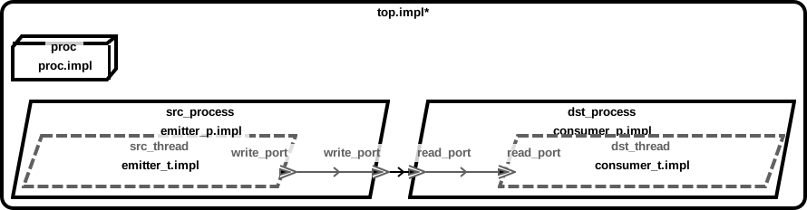
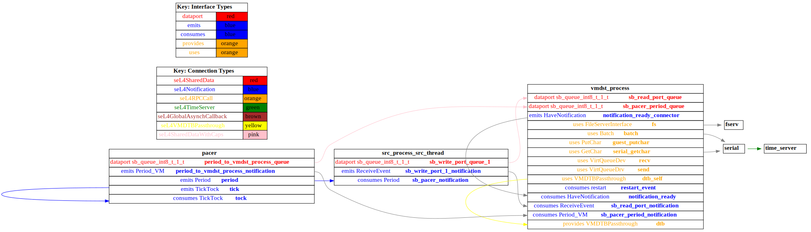
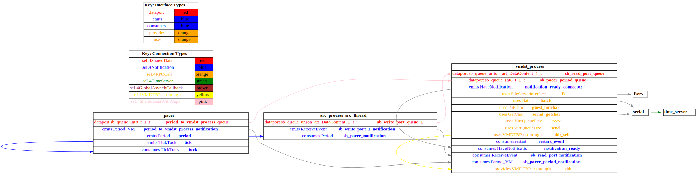

# receiver_vm

 Table of Contents
<!--table-of-contents_start-->
  * [AADL Architecture](#aadl-architecture)
  * [SeL4_Only](#sel4_only)
    * [HAMR Configuration: SeL4_Only](#hamr-configuration-sel4_only)
    * [Behavior Code: SeL4_Only](#behavior-code-sel4_only)
    * [How to Build/Run: SeL4_Only](#how-to-buildrun-sel4_only)
    * [Example Output: SeL4_Only](#example-output-sel4_only)
    * [CAmkES Architecture: SeL4_Only](#camkes-architecture-sel4_only)
    * [HAMR CAmkES Architecture: SeL4_Only](#hamr-camkes-architecture-sel4_only)
  * [SeL4](#sel4)
    * [HAMR Configuration: SeL4](#hamr-configuration-sel4)
    * [Behavior Code: SeL4](#behavior-code-sel4)
    * [How to Build/Run: SeL4](#how-to-buildrun-sel4)
    * [Example Output: SeL4](#example-output-sel4)
    * [CAmkES Architecture: SeL4](#camkes-architecture-sel4)
    * [HAMR CAmkES Architecture: SeL4](#hamr-camkes-architecture-sel4)
<!--table-of-contents_end-->


## AADL Architecture
<!--aadl-architecture_start-->

|System: [top_impl_Instance](aadl/test_event_data_port_periodic_domains.aadl#L95) Properties|
|--|
|Domain Scheduling|

|[src_thread](aadl/test_event_data_port_periodic_domains.aadl#L13) Properties|
|--|
|Native|
|Periodic: 1000 ms|
|Domain: 2|


|[dst_thread](aadl/test_event_data_port_periodic_domains.aadl#L44) Properties|
|--|
|Virtual Machine|
|Periodic: 1000 ms|
|Domain: 3|


**Schedule:** [domain_schedule.c](aadl/behavior_code/kernel/domain_schedule.c)
<!--aadl-architecture_end-->


## SeL4_Only
<!--SeL4_Only_start--><!--SeL4_Only_end-->

### HAMR Configuration: SeL4_Only
<!--hamr-configuration-sel4_only_start-->
To run HAMR Codegen, select [this](aadl/test_event_data_port_periodic_domains.aadl#L95) system implementation in FMIDE's outline view and then click the
HAMR button in the toolbar.  Use the following values in the dialog box that opens up (_&lt;example-dir&gt;_ is the directory that contains this readme file)

Option Name|Value |
|--|--|
Platform|SeL4_Only|
|seL4/CAmkES Output Directory|_&lt;example-dir&gt;_/hamr_seL4_Only/camkes

You can have HAMR's FMIDE plugin generate verbose output and run the transpiler by setting the ``Verbose output`` and ``Run Transpiler``
options that are located in __Preferences >> OSATE >> Sireum HAMR >> Code Generation__.


<details>

<summary>Click for instructions on how to run HAMR Codegen via the command line</summary>

The script [aadl/bin/run-hamr-SeL4_Only.sh](aadl/bin/run-hamr-SeL4_Only.sh) uses an experimental OSATE/FMIDE plugin we've developed that
allows you to run HAMR's OSATE/FMIDE plugin via the command line.  It has primarily been used/tested
when installed in OSATE (not FMIDE) and under Linux so may not work as expected in FMIDE or
under a different operating system. The script contains instructions on how to install the plugin.

```
./aadl/bin/run-hamr-SeL4_Only.sh <path-to-FMIDE-executable>
```

</details>
<!--hamr-configuration-sel4_only_end-->


### Behavior Code: SeL4_Only
<!--behavior-code-sel4_only_start-->
  * [src_thread](aadl/behavior_code/components/emitter/src/emitter.c)

  * [dst_thread](aadl/behavior_code/components/consumer/src/consumer.c)
<!--behavior-code-sel4_only_end-->


### How to Build/Run: SeL4_Only
<!--how-to-buildrun-sel4_only_start-->
```
./hamr_seL4_Only/camkes/bin/run-camkes.sh -s
```
<!--how-to-buildrun-sel4_only_end-->


### Example Output: SeL4_Only
<!--example-output-sel4_only_start-->
Timeout = 90 seconds
```
Booting all finished, dropped to user space
<<seL4(CPU 0) [decodeUntypedInvocation/205 T0x80bf815400 "rootserver" @4006f8]: Untyped Retype: Insufficient memory (1 * 2097152 bytes needed, 0 bytes available).>>
<<seL4(CPU 0) [maskVMRights/187 T0x80bf815400 "rootserver" @4006f8]: Attempted to make unsupported write only mapping>>
<<seL4(CPU 0) [maskVMRights/187 T0x80bf815400 "rootserver" @4006f8]: Attempted to make unsupported write only mapping>>
_utspace_split_alloc@split.c:266 Failed to find any untyped capable of creating an object at address 0x8040000
Loading Linux: 'linux' dtb: ''
install_linux_devices@main.c:651 module name: map_frame_hack
install_linux_devices@main.c:651 module name: init_ram
[src_process_src_thread] test_event_data_port_emitter_component_init called
[src_process_src_thread] sending 0
[src_process_src_thread] sending 1
[src_process_src_thread] sending 2
install_linux_devices@main.c:651 module name: virtio_con
install_linux_devices@main.c:651 module name: cross_vm_connections
[src_process_src_thread] sending 3
[src_process_src_thread] sending 4
[src_process_src_thread] sending 5
[src_process_src_thread] sending 6
[src_process_src_thread] sending 7
[src_process_src_thread] sending 8
[src_process_src_thread] sending 9
[src_process_src_thread] sending 10
[src_process_src_thread] sending 11
[src_process_src_thread] sending 12
[src_process_src_thread] sending 13
[src_process_src_thread] sending 14
[src_process_src_thread] sending 15
[src_process_src_thread] sending 16
[src_process_src_thread] sending 17
[src_process_src_thread] sending 18
[src_process_src_thread] sending 19
[src_process_src_thread] sending 20
[src_process_src_thread] sending 21
[src_process_src_thread] sending 22
[src_process_src_thread] sending 23
libsel4muslcsys: Error attempting syscall 215
[src_process_src_thread] sending 24
[src_process_src_thread] sending 25
[src_process_src_thread] sending 26
[src_process_src_thread] sending 27
[src_process_src_thread] sending 28
[src_process_src_thread] sending 29
[src_process_src_thread] sending 30
[src_process_src_thread] sending 31
[src_process_src_thread] sending 32
[src_process_src_thread] sending 33
libsel4muslcsys: Error attempting syscall 215
[src_process_src_thread] sending 34
clean_up@fdtgen.c:364 Non-existing node None specified to be kept
consume_connection_event@cross_vm_connection.c:241 Failed to inject connection irq
consume_connection_event@cross_vm_connection.c:241 Failed to inject connection irq
_utspace_split_alloc@split.c:266 Failed to find any untyped capable of creating an object at address 0x8020000
alloc_vm_device_cap@main.c:938 Grabbing the entire cap for device memory
alloc_vm_device_cap@main.c:941 Failed to grab the entire cap
[src_process_src_thread] sending 35
consume_connection_event@cross_vm_connection.c:241 Failed to inject connection irq
consume_connection_event@cross_vm_connection.c:241 Failed to inject connection irq
[src_process_src_thread] sending 36
consume_connection_event@cross_vm_connection.c:241 Failed to inject connection irq
consume_connection_event@cross_vm_connection.c:241 Failed to inject connection irq
[    3.216691] Unable to detect cache hierarchy for CPU 0
[    3.235854] e1000: Intel(R) PRO/1000 Network Driver - version 7.3.21-k8-NAPI
[    3.251957] e1000: Copyright (c) 1999-2006 Intel Corporation.
[    3.266739] e1000e: Intel(R) PRO/1000 Network Driver - 3.2.6-k
[    3.280382] e1000e: Copyright(c) 1999 - 2015 Intel Corporation.
[    3.304409] mousedev: PS/2 mouse device common for all mice
[    3.330117] ledtrig-cpu: registered to indicate activity on CPUs
[    3.344083] dmi-sysfs: dmi entry is absent.
[    3.355446] ipip: IPv4 and MPLS over IPv4 tunneling driver
[    3.377050] NET: Registered protocol family 10
[    3.408519] mip6: Mobile IPv6[src_process_src_thread] sending 37

[    4.096168] NET: Registered protocol family 17
[    4.108358] mpls_gso: MPLS GSO support
[    4.116837] Registered cp15_barrier emulation handler
[    4.128654] Registered setend emulation handler
[    4.148205] registered taskstats version 1
[    4.160427] zswap: loaded using pool lzo/zbud
[    4.177114] ima: No TPM chip found, activating TPM-bypass!
[    4.190894] ima: Allocated hash algorithm: sha256
[    4.215944] hctosys: unable to open rtc device (rtc0)
[    4.230672] PM: Hibernation image not present or could not be loaded.
[    4.246664] initcall clk_disable_unused blacklisted
[    4.302538] Freeing unused kernel memory: 3776K
[src_process_src_thread] sending 38
Starting syslogd: OK
Starting klogd: [src_process_src_thread] sending 39
OK
Running sysctl: [src_process_src_thread] sending 40
OK
Initializing random number generator... [    8.934730] random: dd: uninitialized urandom read (512 bytes read)
done.
[src_process_src_thread] sending 41
Starting network: OK
[   10.403902] connection: loading out-of-tree module taints kernel.
[src_process_src_thread] sending 42
[   10.474497] Event Bar (dev-0) initalised
[   11.201414] 2 Dataports (dev-0) initalised
[   11.230648] Event Bar (dev-1) initalised
[   11.247712] 2 Dataports (dev-1) initalised

Welcome to Buildroot
buildroot login: [src_process_src_thread] sending 43
[src_process_src_thread] sending 44
root
# [src_process_src_thread] sending 45
# vmdst_process [src_process_src_thread] sending 46

VM App vmdst_process started
[vmdst_process] test_event_data_port_consumer_component_init called
[src_process_src_thread] sending 47
[vmdst_process] received {47}
[src_process_src_thread] sending 48
[vmdst_process] received {48}
[src_process_src_thread] sending 49
[vmdst_process] received {49}
[src_process_src_thread] sending 50
[vmdst_process] received {50}
[src_process_src_thread] sending 51
[vmdst_process] received {51}
[src_process_src_thread] sending 52
[vmdst_process] received {52}
[src_process_src_thread] sending 53
[vmdst_process] received {53}
QEMU: Terminated
```
<!--example-output-sel4_only_end-->


### CAmkES Architecture: SeL4_Only
<!--camkes-architecture-sel4_only_start-->

<!--camkes-architecture-sel4_only_end-->


### HAMR CAmkES Architecture: SeL4_Only
<!--hamr-camkes-architecture-sel4_only_start-->

<!--hamr-camkes-architecture-sel4_only_end-->


## SeL4
<!--SeL4_start--><!--SeL4_end-->

### HAMR Configuration: SeL4
<!--hamr-configuration-sel4_start-->
To run HAMR Codegen, select [this](aadl/test_event_data_port_periodic_domains.aadl#L95) system implementation in FMIDE's outline view and then click the
HAMR button in the toolbar.  Use the following values in the dialog box that opens up (_&lt;example-dir&gt;_ is the directory that contains this readme file)

Option Name|Value |
|--|--|
Platform|SeL4|
Output Directory|_&lt;example-dir&gt;_/hamr_seL4/slang|
Base Package Name|receiver_vm|
|Exclude Slang Component Implementations|True/Checked|
|Bit Width|32|
|Max Sequence Size|1|
|Max String Size|256|
|C Output Directory|_&lt;example-dir&gt;_/hamr_seL4/c|
|seL4/CAmkES Output Directory|_&lt;example-dir&gt;_/hamr_seL4/camkes

You can have HAMR's FMIDE plugin generate verbose output and run the transpiler by setting the ``Verbose output`` and ``Run Transpiler``
options that are located in __Preferences >> OSATE >> Sireum HAMR >> Code Generation__.


<details>

<summary>Click for instructions on how to run HAMR Codegen via the command line</summary>

The script [aadl/bin/run-hamr-SeL4.sh](aadl/bin/run-hamr-SeL4.sh) uses an experimental OSATE/FMIDE plugin we've developed that
allows you to run HAMR's OSATE/FMIDE plugin via the command line.  It has primarily been used/tested
when installed in OSATE (not FMIDE) and under Linux so may not work as expected in FMIDE or
under a different operating system. The script contains instructions on how to install the plugin.

```
./aadl/bin/run-hamr-SeL4.sh <path-to-FMIDE-executable>
```

</details>
<!--hamr-configuration-sel4_end-->


### Behavior Code: SeL4
<!--behavior-code-sel4_start-->
  * [src_thread](hamr_seL4/c/ext-c/emitter_t_impl_src_process_src_thread/emitter_t_impl_src_process_src_thread.c)

  * [dst_thread (includes VM glue code)](hamr_seL4/camkes/components/VM/apps/vmdst_process/vmdst_process.c)
<!--behavior-code-sel4_end-->


### How to Build/Run: SeL4
<!--how-to-buildrun-sel4_start-->
If you didn't configure HAMR's FMIDE plugin to run the transpiler automatically then run
```
./hamr_seL4/slang/bin/transpile-sel4.cmd
```
then

```
./hamr_seL4/camkes/bin/run-camkes.sh -s
```
<!--how-to-buildrun-sel4_end-->


### Example Output: SeL4
<!--example-output-sel4_start-->
Timeout = 90 seconds
```
Booting all finished, dropped to user space
<<seL4(CPU 0) [decodeUntypedInvocation/205 T0x80bf816400 "rootserver" @4006f8]: Untyped Retype: Insufficient memory (1 * 2097152 bytes needed, 0 bytes available).>>
<<seL4(CPU 0) [maskVMRights/187 T0x80bf816400 "rootserver" @4006f8]: Attempted to make unsupported write only mapping>>
<<seL4(CPU 0) [maskVMRights/187 T0x80bf816400 "rootserver" @4006f8]: Attempted to make unsupported write only mapping>>
Entering pre-init of emitter_t_impl_src_process_src_thread
top_impl_Instance_src_process_src_thread: receiver_vm_test_event_data_port_periodic_domains_emitter_t_impl_src_process_src_thread_initialise_ called
Leaving pre-init of emitter_t_impl_src_process_src_thread
_utspace_split_alloc@split.c:266 Failed to find any untyped capable of creating an object at address 0x8040000
Loading Linux: 'linux' dtb: ''
install_linux_devices@main.c:651 module name: map_frame_hack
install_linux_devices@main.c:651 module name: init_ram
[top_impl_Instance_src_process_src_thread] Sending 1 on event data port write_port
[top_impl_Instance_src_process_src_thread] Sending 2 on event data port write_port
[top_impl_Instance_src_process_src_thread] Sending 3 on event data port write_port
install_linux_devices@main.c:651 module name: virtio_con
install_linux_devices@main.c:651 module name: cross_vm_connections
[top_impl_Instance_src_process_src_thread] Sending 4 on event data port write_port
[top_impl_Instance_src_process_src_thread] Sending 5 on event data port write_port
[top_impl_Instance_src_process_src_thread] Sending 6 on event data port write_port
[top_impl_Instance_src_process_src_thread] Sending 7 on event data port write_port
[top_impl_Instance_src_process_src_thread] Sending 8 on event data port write_port
[top_impl_Instance_src_process_src_thread] Sending 9 on event data port write_port
[top_impl_Instance_src_process_src_thread] Sending 10 on event data port write_port
[top_impl_Instance_src_process_src_thread] Sending 11 on event data port write_port
[top_impl_Instance_src_process_src_thread] Sending 12 on event data port write_port
[top_impl_Instance_src_process_src_thread] Sending 13 on event data port write_port
[top_impl_Instance_src_process_src_thread] Sending 14 on event data port write_port
[top_impl_Instance_src_process_src_thread] Sending 15 on event data port write_port
[top_impl_Instance_src_process_src_thread] Sending 16 on event data port write_port
[top_impl_Instance_src_process_src_thread] Sending 17 on event data port write_port
[top_impl_Instance_src_process_src_thread] Sending 18 on event data port write_port
[top_impl_Instance_src_process_src_thread] Sending 19 on event data port write_port
[top_impl_Instance_src_process_src_thread] Sending 20 on event data port write_port
[top_impl_Instance_src_process_src_thread] Sending 21 on event data port write_port
[top_impl_Instance_src_process_src_thread] Sending 22 on event data port write_port
[top_impl_Instance_src_process_src_thread] Sending 23 on event data port write_port
[top_impl_Instance_src_process_src_thread] Sending 24 on event data port write_port
libsel4muslcsys: Error attempting syscall 215
[top_impl_Instance_src_process_src_thread] Sending 25 on event data port write_port
[top_impl_Instance_src_process_src_thread] Sending 26 on event data port write_port
[top_impl_Instance_src_process_src_thread] Sending 27 on event data port write_port
[top_impl_Instance_src_process_src_thread] Sending 28 on event data port write_port
[top_impl_Instance_src_process_src_thread] Sending 29 on event data port write_port
[top_impl_Instance_src_process_src_thread] Sending 30 on event data port write_port
[top_impl_Instance_src_process_src_thread] Sending 31 on event data port write_port
[top_impl_Instance_src_process_src_thread] Sending 32 on event data port write_port
[top_impl_Instance_src_process_src_thread] Sending 33 on event data port write_port
[top_impl_Instance_src_process_src_thread] Sending 34 on event data port write_port
libsel4muslcsys: Error attempting syscall 215
[top_impl_Instance_src_process_src_thread] Sending 35 on event data port write_port
clean_up@fdtgen.c:364 Non-existing node None specified to be kept
consume_connection_event@cross_vm_connection.c:241 Failed to inject connection irq
consume_connection_event@cross_vm_connection.c:241 Failed to inject connection irq
_utspace_split_alloc@split.c:266 Failed to find any untyped capable of creating an object at address 0x8020000
alloc_vm_device_cap@main.c:938 Grabbing the entire cap for device memory
alloc_vm_device_cap@main.c:941 Failed to grab the entire cap
[top_impl_Instance_src_process_src_thread] Sending 36 on event data port write_port
consume_connection_event@cross_vm_connection.c:241 Failed to inject connection irq
consume_connection_event@cross_vm_connection.c:241 Failed to inject connection irq
[top_impl_Instance_src_process_src_thread] Sending 37 on event data port write_port
consume_connection_event@cross_vm_connection.c:241 Failed to inject connection irq
consume_connection_event@cross_vm_connection.c:241 Failed to inject connection irq
[    3.302183] Unable to detect cache hierarchy for CPU 0
[    3.323000] e1000: Intel(R) PRO/1000 Network Driver - version 7.3.21-k8-NAPI
[    3.339063] e1000: Copyright (c) 1999-2006 Intel Corporation.
[    3.354193] e1000e: Intel(R) PRO/1000 Network Driver - 3.2.6-k
[    3.367363] e1000e: Copyright(c) 1999 - 2015 Intel Corporation.
[    3.387497] mousedev: PS/2 mouse device common for all mice
[    3.410062] ledtrig-cpu: registered to indicate activity on CPUs
[    3.425792] dmi-sysfs: dmi entry is absent.
[    3.437595] ipip: IPv4 and MPLS over IPv4 tunneling driver
[    3.456504] NET: Registered protocol family 10
[    3.488567] mip6: Mobile IPv6
[    3.504582] NET: Registered protocol family 17
[    3.516003] mpls_gso: MPLS GSO support
[    3.526049] Registered cp15_barrier emulation handler
[    3.537695] Registered setend emulation handler
[    3.554403] registered taskstats version 1
[    3.566290] zswap: loaded using pool lzo/zbud
[    3.583221] ima: No TPM chip found, activating TPM-bypass!
[    3.594643] ima: Allocated hash algorithm: sha256
[    3.617650] hctosys: unable to open rtc device (rtc0)
[    3.630145] PM: Hibernation image not present or could not be loaded.
[    3.643323] initcall clk_disable_unused blacklisted
[    3.690494] Freeing unused kernel memory: 3776K
[top_impl_Instance_src_process_src_thread] Sending 38 on event data port write_port
[top_impl_Instance_src_process_src_thread] Sending 39 on event data port write_port
Starting syslogd: OK
Starting klogd: OK
Running sysctl: [top_impl_Instance_src_process_src_thread] Sending 40 on event data port write_port
OK
Initializing random number generator... [    8.594191] random: dd: uninitialized urandom read (512 bytes read)
done.
[top_impl_Instance_src_process_src_thread] Sending 41 on event data port write_port
Starting network: OK
[   10.231103] connection: loading out-of-tree module taints kernel.
[   10.279780] Event Bar (dev-0) initalised
[   10.291475] 2 Dataports (dev-0) initalised
[   10.321163] Event Bar (dev-1) initalised
[   10.342784] 2 Dataports (dev-1) initalised
[top_impl_Instance_src_process_src_thread] Sending 42 on event data port write_port

Welcome to Buildroot
buildroot login: [top_impl_Instance_src_process_src_thread] Sending 43 on event data port write_port
ro[top_impl_Instance_src_process_src_thread] Sending 44 on event data port write_port
ot
# [top_impl_Instance_src_process_src_thread] Sending 45 on event data port write_port
# vmdst_process [top_impl_Instance_src_process_src_thread] Sending 46 on event data port write_port

VM App vmconsumer started
Setting up incoming data port /dev/uio0 with size 4096
Successfully setup incoming data port /dev/uio0
Setting up incoming event data port /dev/uio1 with size 4096
Successfully setup incoming event data port /dev/uio1
Hello from vmconsumer's run method
vmconsumer: Received 46 bits on read_port
[top_impl_Instance_src_process_src_thread] Sending 47 on event data port write_port
vmconsumer: Received 47 bits on read_port
[top_impl_Instance_src_process_src_thread] Sending 48 on event data port write_port
vmconsumer: Received 48 bits on read_port
[top_impl_Instance_src_process_src_thread] Sending 49 on event data port write_port
vmconsumer: Received 49 bits on read_port
[top_impl_Instance_src_process_src_thread] Sending 50 on event data port write_port
vmconsumer: Received 50 bits on read_port
[top_impl_Instance_src_process_src_thread] Sending 51 on event data port write_port
vmconsumer: Received 51 bits on read_port
QEMU: Terminated
```
<!--example-output-sel4_end-->


### CAmkES Architecture: SeL4
<!--camkes-architecture-sel4_start-->

<!--camkes-architecture-sel4_end-->


### HAMR CAmkES Architecture: SeL4
<!--hamr-camkes-architecture-sel4_start-->

<!--hamr-camkes-architecture-sel4_end-->

