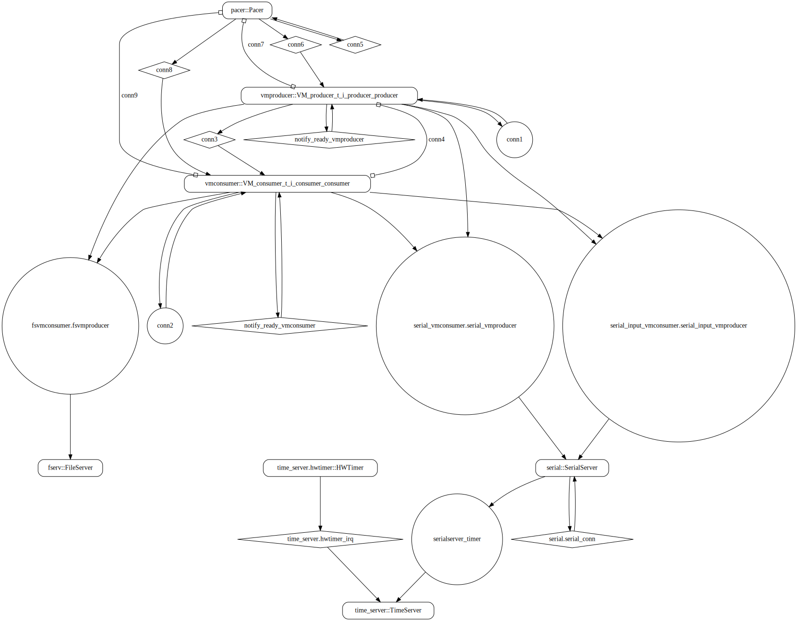
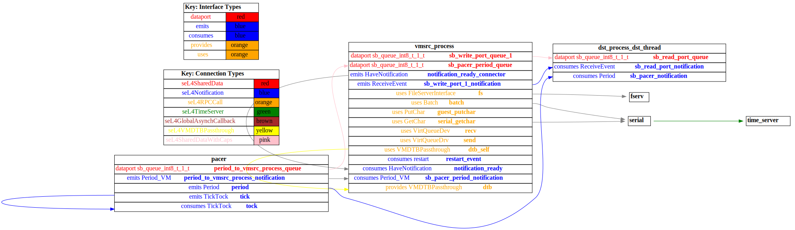
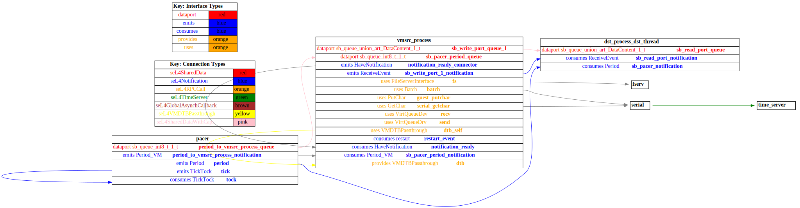

# sender_vm

 Table of Contents
<!--table-of-contents_start-->
  * [AADL Architecture](#aadl-architecture)
  * [SeL4_Only](#sel4_only)
    * [HAMR Configuration: SeL4_Only](#hamr-configuration-sel4_only)
    * [Behavior Code: SeL4_Only](#behavior-code-sel4_only)
    * [How to Build/Run: SeL4_Only](#how-to-buildrun-sel4_only)
    * [Example Output: SeL4_Only](#example-output-sel4_only)
    * [CAmkES Architecture: SeL4_Only](#camkes-architecture-sel4_only)
    * [HAMR CAmkES Architecture: SeL4_Only](#hamr-camkes-architecture-sel4_only)
  * [SeL4](#sel4)
    * [HAMR Configuration: SeL4](#hamr-configuration-sel4)
    * [Behavior Code: SeL4](#behavior-code-sel4)
    * [How to Build/Run: SeL4](#how-to-buildrun-sel4)
    * [Example Output: SeL4](#example-output-sel4)
    * [CAmkES Architecture: SeL4](#camkes-architecture-sel4)
    * [HAMR CAmkES Architecture: SeL4](#hamr-camkes-architecture-sel4)
<!--table-of-contents_end-->


## AADL Architecture
<!--aadl-architecture_start-->

|System: [top_impl_Instance](aadl/test_event_data_port_periodic_domains.aadl#L95) Properties|
|--|
|Domain Scheduling|

|[src_thread](aadl/test_event_data_port_periodic_domains.aadl#L13) Properties|
|--|
|Virtual Machine|
|Periodic: 1000 ms|
|Domain: 2|


|[dst_thread](aadl/test_event_data_port_periodic_domains.aadl#L44) Properties|
|--|
|Native|
|Periodic: 1000 ms|
|Domain: 3|


**Schedule:** [domain_schedule.c](aadl/behavior_code/kernel/domain_schedule.c)
<!--aadl-architecture_end-->


## SeL4_Only
<!--SeL4_Only_start--><!--SeL4_Only_end-->

### HAMR Configuration: SeL4_Only
<!--hamr-configuration-sel4_only_start-->
To run HAMR Codegen, select [this](aadl/test_event_data_port_periodic_domains.aadl#L95) system implementation in FMIDE's outline view and then click the
HAMR button in the toolbar.  Use the following values in the dialog box that opens up (_&lt;example-dir&gt;_ is the directory that contains this readme file)

Option Name|Value |
|--|--|
Platform|SeL4_Only|
|seL4/CAmkES Output Directory|_&lt;example-dir&gt;_/hamr_seL4_Only/camkes

You can have HAMR's FMIDE plugin generate verbose output and run the transpiler by setting the ``Verbose output`` and ``Run Transpiler``
options that are located in __Preferences >> OSATE >> Sireum HAMR >> Code Generation__.


<details>

<summary>Click for instructions on how to run HAMR Codegen via the command line</summary>

The script [aadl/bin/run-hamr-SeL4_Only.sh](aadl/bin/run-hamr-SeL4_Only.sh) uses an experimental OSATE/FMIDE plugin we've developed that
allows you to run HAMR's OSATE/FMIDE plugin via the command line.  It has primarily been used/tested
when installed in OSATE (not FMIDE) and under Linux so may not work as expected in FMIDE or
under a different operating system. The script contains instructions on how to install the plugin.

```
./aadl/bin/run-hamr-SeL4_Only.sh <path-to-FMIDE-executable>
```

</details>
<!--hamr-configuration-sel4_only_end-->


### Behavior Code: SeL4_Only
<!--behavior-code-sel4_only_start-->
  * [src_thread](aadl/behavior_code/components/emitter/src/emitter.c)

  * [dst_thread](aadl/behavior_code/components/consumer/src/consumer.c)
<!--behavior-code-sel4_only_end-->


### How to Build/Run: SeL4_Only
<!--how-to-buildrun-sel4_only_start-->
```
./hamr_seL4_Only/camkes/bin/run-camkes.sh -s
```
<!--how-to-buildrun-sel4_only_end-->


### Example Output: SeL4_Only
<!--example-output-sel4_only_start-->
Timeout = 90 seconds
```
Bootstrapping kernel
Warning: Could not infer GIC interrupt target ID, assuming 0.
available phys memory regions: 1
  [60000000..c0000000]
reserved virt address space regions: 3
  [8060000000..8060246000]
  [8060246000..8060247dbc]
  [8060248000..8061b91000]
Booting all finished, dropped to user space
<<seL4(CPU 0) [decodeUntypedInvocation/205 T0x80bf815400 "rootserver" @4006f8]: Untyped Retype: Insufficient memory (1 * 2097152 bytes needed, 0 bytes available).>>
<<seL4(CPU 0) [maskVMRights/187 T0x80bf815400 "rootserver" @4006f8]: Attempted to make unsupported write only mapping>>
_utspace_split_alloc@split.c:266 Failed to find any untyped capable of creating an object at address 0x8040000
Loading Linux: 'linux' dtb: ''
install_linux_devices@main.c:651 module name: map_frame_hack
install_linux_devices@main.c:651 module name: init_ram
[dst_process_dst_thread] test_event_data_port_consumer_component_init called
install_linux_devices@main.c:651 module name: virtio_con
install_linux_devices@main.c:651 module name: cross_vm_connections
libsel4muslcsys: Error attempting syscall 215
libsel4muslcsys: Error attempting syscall 215
clean_up@fdtgen.c:364 Non-existing node None specified to be kept
consume_connection_event@cross_vm_connection.c:241 Failed to inject connection irq
_utspace_split_alloc@split.c:266 Failed to find any untyped capable of creating an object at address 0x8020000
alloc_vm_device_cap@main.c:938 Grabbing the entire cap for device memory
alloc_vm_device_cap@main.c:941 Failed to grab the entire cap
consume_connection_event@cross_vm_connection.c:241 Failed to inject connection irq
consume_connection_event@cross_vm_connection.c:241 Failed to inject connection irq
[    3.155396] Unable to detect cache hierarchy for CPU 0
[    3.176121] e1000: Intel(R) PRO/1000 Network Driver - version 7.3.21-k8-NAPI
[    3.192928] e1000: Copyright (c) 1999-2006 Intel Corporation.
[    3.207830] e1000e: Intel(R) PRO/1000 Network Driver - 3.2.6-k
[    3.222330] e1000e: Copyright(c) 1999 - 2015 Intel Corporation.
[    3.243845] mousedev: PS/2 mouse device common for all mice
[    3.272162] ledtrig-cpu: registered to indicate activity on CPUs
[    3.286891] dmi-sysfs: dmi entry is absent.
[    3.300132] ipip: IPv4 and MPLS over IPv4 tunneling driver
[    3.323906] NET: Registered protocol family 10
[    3.354302] mip6: Mobile IPv6
[    3.372729] NET: Registered protocol family 17
[    3.384152] mpls_gso: MPLS GSO support
[    3.394410] Registered cp15_barrier emulation handler
[    3.407317] Registered setend emulation handler
[    3.425337] registered taskstats version 1
[    3.437170] zswap: loaded using pool lzo/zbud
[    3.454815] ima: No TPM chip found, activating TPM-bypass!
[    4.224326] ima: Allocated hash algorithm: sha256
[    4.247611] hctosys: unable to open rtc device (rtc0)
[    4.260485] PM: Hibernation image not present or could not be loaded.
[    4.274354] initcall clk_disable_unused blacklisted
[    4.331239] Freeing unused kernel memory: 3776K
Starting syslogd: OK
Starting klogd: OK
Running sysctl: OK
Initializing random number generator... [    9.636768] random: dd: uninitialized urandom read (512 bytes read)
done.
Starting network: OK
[   11.271024] connection: loading out-of-tree module taints kernel.
[   11.315306] Event Bar (dev-0) initalised
[   11.344451] 2 Dataports (dev-0) initalised
[   11.366267] Event Bar (dev-1) initalised
[   11.386198] 2 Dataports (dev-1) initalised

Welcome to Buildroot
buildroot login: root
# vmsrc_process 
VM App vmsrc_process started
[vmsrc_process] test_event_data_port_emitter_component_init called
[vmsrc_process] sending 0
[dst_process_dst_thread] received {0}
[vmsrc_process] sending 1
[dst_process_dst_thread] received {1}
[vmsrc_process] sending 2
[dst_process_dst_thread] received {2}
[vmsrc_process] sending 3
[dst_process_dst_thread] received {3}
[vmsrc_process] sending 4
[dst_process_dst_thread] received {4}
[vmsrc_process] sending 5
[dst_process_dst_thread] received {5}
[vmsrc_process] sending 6
[dst_process_dst_thread] received {6}
QEMU: Terminated
```
<!--example-output-sel4_only_end-->


### CAmkES Architecture: SeL4_Only
<!--camkes-architecture-sel4_only_start-->

<!--camkes-architecture-sel4_only_end-->


### HAMR CAmkES Architecture: SeL4_Only
<!--hamr-camkes-architecture-sel4_only_start-->

<!--hamr-camkes-architecture-sel4_only_end-->


## SeL4
<!--SeL4_start--><!--SeL4_end-->

### HAMR Configuration: SeL4
<!--hamr-configuration-sel4_start-->
To run HAMR Codegen, select [this](aadl/test_event_data_port_periodic_domains.aadl#L95) system implementation in FMIDE's outline view and then click the
HAMR button in the toolbar.  Use the following values in the dialog box that opens up (_&lt;example-dir&gt;_ is the directory that contains this readme file)

Option Name|Value |
|--|--|
Platform|SeL4|
Output Directory|_&lt;example-dir&gt;_/hamr_seL4/slang|
Base Package Name|sender_vm|
|Exclude Slang Component Implementations|True/Checked|
|Bit Width|32|
|Max Sequence Size|1|
|Max String Size|256|
|C Output Directory|_&lt;example-dir&gt;_/hamr_seL4/c|
|seL4/CAmkES Output Directory|_&lt;example-dir&gt;_/hamr_seL4/camkes

You can have HAMR's FMIDE plugin generate verbose output and run the transpiler by setting the ``Verbose output`` and ``Run Transpiler``
options that are located in __Preferences >> OSATE >> Sireum HAMR >> Code Generation__.


<details>

<summary>Click for instructions on how to run HAMR Codegen via the command line</summary>

The script [aadl/bin/run-hamr-SeL4.sh](aadl/bin/run-hamr-SeL4.sh) uses an experimental OSATE/FMIDE plugin we've developed that
allows you to run HAMR's OSATE/FMIDE plugin via the command line.  It has primarily been used/tested
when installed in OSATE (not FMIDE) and under Linux so may not work as expected in FMIDE or
under a different operating system. The script contains instructions on how to install the plugin.

```
./aadl/bin/run-hamr-SeL4.sh <path-to-FMIDE-executable>
```

</details>
<!--hamr-configuration-sel4_end-->


### Behavior Code: SeL4
<!--behavior-code-sel4_start-->
  * [src_thread (includes VM glue code)](hamr_seL4/camkes/components/VM/apps/vmsrc_process/vmsrc_process.c)

  * [dst_thread](hamr_seL4/c/ext-c/consumer_t_impl_dst_process_dst_thread/consumer_t_impl_dst_process_dst_thread.c)
<!--behavior-code-sel4_end-->


### How to Build/Run: SeL4
<!--how-to-buildrun-sel4_start-->
If you didn't configure HAMR's FMIDE plugin to run the transpiler automatically then run
```
./hamr_seL4/slang/bin/transpile-sel4.cmd
```
then

```
./hamr_seL4/camkes/bin/run-camkes.sh -s
```
<!--how-to-buildrun-sel4_end-->


### Example Output: SeL4
<!--example-output-sel4_start-->
Timeout = 90 seconds
```
Booting all finished, dropped to user space
<<seL4(CPU 0) [decodeUntypedInvocation/205 T0x80bf816400 "rootserver" @4006f8]: Untyped Retype: Insufficient memory (1 * 2097152 bytes needed, 0 bytes available).>>
<<seL4(CPU 0) [maskVMRights/187 T0x80bf816400 "rootserver" @4006f8]: Attempted to make unsupported write only mapping>>
Entering pre-init of consumer_t_impl_dst_process_dst_thread
_utspace_split_alloc@split.c:266 Failed to find any untyped capable of creating an object at address 0x8040000
Loading Linux: 'linux' dtb: ''
install_linux_devices@main.c:651 module name: map_frame_hack
install_linux_devices@main.c:651 module name: init_ram
top_impl_Instance_dst_process_dst_thread: sender_vm_test_event_data_port_periodic_domains_consumer_t_impl_dst_process_dst_thread_initialise_ called
Leaving pre-init of consumer_t_impl_dst_process_dst_thread
install_linux_devices@main.c:651 module name: virtio_con
install_linux_devices@main.c:651 module name: cross_vm_connections
libsel4muslcsys: Error attempting syscall 215
libsel4muslcsys: Error attempting syscall 215
clean_up@fdtgen.c:364 Non-existing node None specified to be kept
consume_connection_event@cross_vm_connection.c:241 Failed to inject connection irq
_utspace_split_alloc@split.c:266 Failed to find any untyped capable of creating an object at address 0x8020000
alloc_vm_device_cap@main.c:938 Grabbing the entire cap for device memory
alloc_vm_device_cap@main.c:941 Failed to grab the entire cap
consume_connection_event@cross_vm_connection.c:241 Failed to inject connection irq
consume_connection_event@cross_vm_connection.c:241 Failed to inject connection irq
[    3.013761] Unable to detect cache hierarchy for CPU 0
[    3.703965] e1000: Intel(R) PRO/1000 Network Driver - version 7.3.21-k8-NAPI
[    3.719117] e1000: Copyright (c) 1999-2006 Intel Corporation.
[    3.731640] e1000e: Intel(R) PRO/1000 Network Driver - 3.2.6-k
[    3.744154] e1000e: Copyright(c) 1999 - 2015 Intel Corporation.
[    3.761517] mousedev: PS/2 mouse device common for all mice
[    3.785188] ledtrig-cpu: registered to indicate activity on CPUs
[    3.801020] dmi-sysfs: dmi entry is absent.
[    3.814398] ipip: IPv4 and MPLS over IPv4 tunneling driver
[    3.833661] NET: Registered protocol family 10
[    3.863153] mip6: Mobile IPv6
[    3.878464] NET: Registered protocol family 17
[    3.890034] mpls_gso: MPLS GSO support
[    3.901061] Registered cp15_barrier emulation handler
[    3.913266] Registered setend emulation handler
[    3.931014] registered taskstats version 1
[    3.941491] zswap: loaded using pool lzo/zbud
[    3.958155] ima: No TPM chip found, activating TPM-bypass!
[    3.970288] ima: Allocated hash algorithm: sha256
[    3.994575] hctosys: unable to open rtc device (rtc0)
[    4.009732] PM: Hibernation image not present or could not be loaded.
[    4.024527] initcall clk_disable_unused blacklisted
[    4.078017] Freeing unused kernel memory: 3776K
Starting syslogd: OK
Starting klogd: OK
Running sysctl: OK
Initializing random number generator... [    9.476796] random: dd: uninitialized urandom read (512 bytes read)
done.
Starting network: OK
[   10.949415] connection: loading out-of-tree module taints kernel.
[   10.990729] Event Bar (dev-0) initalised
[   11.014199] 2 Dataports (dev-0) initalised
[   11.026342] Event Bar (dev-1) initalised
[   11.045021] 2 Dataports (dev-1) initalised

Welcome to Buildroot
buildroot login: root
# vmsrc_process 
VM App vmsrc_process started
Setting up outgoing event data port /dev/uio0 4096
Successfully setup /dev/uio0
Setting up incoming event data port /dev/uio1 with size 4096
Successfully setup incoming event data port /dev/uio1
Hello from vmsrc_process's run method
[vmsrc_process] Sending {0} on write_port
top_impl_Instance_dst_process_dst_thread: Received {0} on event data port read_port: 
[vmsrc_process] Sending {1} on write_port
top_impl_Instance_dst_process_dst_thread: Received {1} on event data port read_port: 
[vmsrc_process] Sending {2} on write_port
top_impl_Instance_dst_process_dst_thread: Received {2} on event data port read_port: 
[vmsrc_process] Sending {3} on write_port
top_impl_Instance_dst_process_dst_thread: Received {3} on event data port read_port: 
[vmsrc_process] Sending {4} on write_port
top_impl_Instance_dst_process_dst_thread: Received {4} on event data port read_port: 
[vmsrc_process] Sending {5} on write_port
top_impl_Instance_dst_process_dst_thread: Received {5} on event data port read_port: 
[vmsrc_process] Sending {6} on write_port
QEMU: Terminated
```
<!--example-output-sel4_end-->


### CAmkES Architecture: SeL4
<!--camkes-architecture-sel4_start-->

<!--camkes-architecture-sel4_end-->


### HAMR CAmkES Architecture: SeL4
<!--hamr-camkes-architecture-sel4_start-->

<!--hamr-camkes-architecture-sel4_end-->

